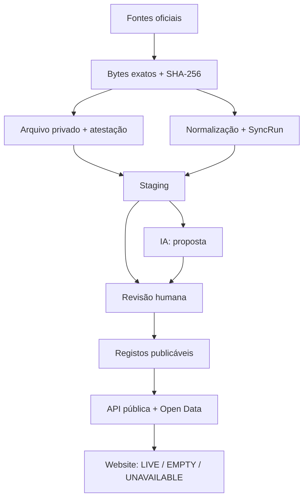

# Transparência Total / Fator Cívico — V4

Plataforma cívica, neutra e sem fins lucrativos para acompanhar atividade política em
Portugal através de dados oficiais auditáveis. O código usa licença MIT; o repositório deve
ser tornado público antes de o projeto se apresentar como open source.

> **Estado do projeto:** esta release fecha o produto público da V4. Inclui arquivo PostgreSQL
> dos bytes oficiais, fotografias parlamentares versionadas e append-only, revisão humana por
> âmbito, API pública fail-closed, catálogo inicial do Programa do XXV Governo e páginas legais.
> O domínio oficial nunca substitui uma falha da API por dados fictícios. Consulte o
> [gate V4 → V5](docs/V4_TO_V5_RELEASE_GATE.md) para a validação operacional da release.

## Princípios

- **Fonte antes da conclusão:** todo o facto publicado conserva URL oficial, data de recolha e
  hash SHA-256 do documento.
- **Ausência não é incumprimento:** lacunas do portal de origem são mostradas como dados
  indisponíveis.
- **Não atribuir por inferência:** uma posição de grupo parlamentar nunca é convertida num voto
  nominal de um deputado.
- **IA não é fonte:** resumos automáticos são rotulados, revistos e ligados ao texto integral.
- **Ligação não é acusação:** uma coincidência de nome, cargo ou identificador cria apenas um
  candidato privado de revisão; nunca prova conflito, benefício, corrupção ou ilícito.
- **Histórico imutável:** correções acrescentam versões e eventos de auditoria; não apagam o
  fundamento anterior.
- **Privacidade mínima:** o website público não usa analítica, publicidade, cookies não essenciais,
  notificações ou perfis de visitantes.

O nome “Transparência Total” descreve a ambição. Nenhum sistema pode garantir a completude de
uma fonte pública; a plataforma torna também visíveis falhas, atrasos e limites conhecidos.

## O que está incluído na V4

- Persistência transacional das fotografias parlamentares e BASE, com `SyncRun`, contagens, avisos
  e versão do coletor. Correções de parser criam uma nova fotografia e preservam a anterior.
- `ParliamentaryMembershipSnapshot`: regista “observado na fonte em”, sem inventar uma data de
  início de mandato quando o dataset não a fornece.
- API de leitura pública para estado dos dados, diretório e perfil de políticos, Promessómetro e
  atividade parlamentar. Conjuntos de investigação permanecem privados até terem revisão efetiva.
- Três modos públicos explícitos: `LIVE`, `EMPTY` e `UNAVAILABLE`; não existe fallback de
  demonstração no domínio oficial.
- Promoção editorial por linha de comando com confirmação explícita, teste de dependências,
  `DataPublicationReview` e `AuditEvent`; a decisão pode ser retirada sem apagar o histórico.
- A persistência BASE exige `ENVIRONMENT=staging`, confirmação explícita, arquivo atestado e carga
  em lote append-only; não cria contratos públicos, entidades, correspondências ou revisões.
- Arquivo privado content-addressed dos bytes oficiais, com recibo verificado antes da persistência
  parlamentar, `SourceArchiveAttestation` imutável e projeções públicas em modo fail-closed.
- Ferramentas separadas para atestar um `SourceDocument` histórico em staging e para verificar o
  objeto em modo exclusivamente de leitura; nenhuma destas operações cria revisão ou publicação.
- Recolha conjunta de reuniões observadas, iniciativas e votações da Assembleia da República,
  arquivo dos bytes antes da normalização, manifesto com SHA-256 normalizado e revisão humana
  separada para atividade e posições de voto.
- API e página pública de atividade parlamentar que selecionam uma única fotografia aprovada por
  legislatura e mostram lacunas sem preencher dados por inferência.

- Frontend Next.js responsivo. O manifesto, Service Worker e notificações permanecem
  desligados da interface pública até existir uma escolha explícita do utilizador.
- Pipeline do Investigador Cívico preservado na API, sem página pública até existir um conjunto
  de relações efetivamente revisto.
- Componentes de grafo e de comparação preservados para trabalho futuro, sem exposição pública
  enquanto não existirem relações e pares comparáveis aprovados.
- Guia do Cidadão com perfil genérico, cálculo determinístico separado da explicação por IA e
  alertas com fontes, vigência, ressalvas e incertezas.
- Formulário de direito de resposta com recibo temporal e hashes SHA-256 sem apagar o original.
- Exportação Open Data em JSON/CSV de contratos, grafo, notícias, alertas e direitos de resposta.
- Perfil de político com cobertura explícita, votos individuais apenas quando nominais,
  posições coletivas separadas e ligação à declaração de interesses.
- Promessómetro filtrável com cinco estados, incluindo “Por verificar”, catálogo inicial do
  programa e fundamentação oficial por medida avaliada.
- Infraestrutura Web Push disponível no backend, mas sem registo automático no website público.
- API FastAPI com documentação OpenAPI, CORS restrito e endpoints de saúde.
- Descoberta e normalização resiliente dos datasets da Assembleia da República e dos recursos
  anuais JSON/XML/ZIP do Portal BASE publicados através do dados.gov.pt.
- Correspondência protegida por HMAC para identificadores pessoais e correspondência exata de
  entidades; não existe fuzzy matching nem publicação automática.
- Leitura de diplomas e RSS configurável do Diário da República.
- Índice de recursos públicos da Entidade para a Transparência.
- Dois pipelines OpenAI Responses API com saída Pydantic estruturada: resumo de diplomas e Guia
  do Cidadão. Ambos exigem revisão humana e o modelo pode abster-se.
- Esquema PostgreSQL/Prisma para pessoas, mandatos, sessões, votos, leis, promessas, fontes,
  notícias, contratos, organizações, relações, processos, respostas, impactos, alertas e auditoria.
- Docker local, CI GitHub Actions e modelos de publicação Vercel, Render e Fly.io.

## Arquitetura



O frontend e o backend são serviços separados. O frontend só consome a API pública; chaves,
coletores, revisão e envio push ficam no backend. Consulte [Arquitetura](docs/ARCHITECTURE.md),
[Neutralidade](docs/NEUTRALITY.md), [Fontes](docs/DATA_SOURCES.md) e
[Governação de IA](docs/AI_GOVERNANCE.md), [Governação V2](docs/V2_GOVERNANCE.md) e
[circuito de dados reais V3](docs/V3_LIVE_DATA.md), além do
[arquivo privado de prova V4.1](docs/V4_RAW_EVIDENCE.md) e do
[staging BASE append-only V4.2](docs/V4_BASE_STAGING.md), bem como do
[pipeline parlamentar V4](docs/V4_PARLIAMENT_PIPELINE.md), das
[operações de produção](docs/V4_PRODUCTION_OPERATIONS.md) e do
[gate V4 → V5](docs/V4_TO_V5_RELEASE_GATE.md), além do
[modelo de AIPD/RGPD](docs/DPIA_TEMPLATE.md).

## Estrutura do projeto

```text
transparencia-total/
├── app/                         # Rotas e layout Next.js App Router
│   ├── direito-de-resposta/
│   ├── atividade-parlamentar/
│   ├── guia-cidadao/
│   ├── investigador/             # Redireciona para metodologia enquanto não há dados revistos
│   ├── metodologia/
│   ├── politicos/               # Diretório e perfis por slug
│   └── promessas/
├── components/                  # Navegação, guia, perfis, Promessómetro e módulos opcionais
├── lib/                         # Cliente tipado da API e catálogo oficial versionado
├── public/
│   ├── icons/                   # Ícones PWA 96/192/512
│   ├── manifest.json
│   ├── offline.html
│   └── sw.js                    # Infraestrutura inativa; versões antigas são removidas no cliente
├── types/                       # Contratos TypeScript da interface
├── backend/
│   ├── app/
│   │   ├── api/routes/          # Leitura pública, Parlamento, DRE, EPT, IA, push
│   │   ├── core/                # Configuração, logs e segurança SSRF
│   │   ├── models/              # Contratos Pydantic
│   │   ├── repositories/        # Acesso assíncrono ao PostgreSQL
│   │   └── services/            # BASE, Parlamento, IA, prova, resposta e Web Push
│   ├── scripts/                 # Sincronização, revisão/publicação e resumo DRE
│   └── tests/                   # Fixtures oficiais anonimizadas e testes
├── db/client.ts                 # Prisma 7 com adapter PostgreSQL
├── prisma/
│   ├── migrations/              # Migrações versionadas
│   ├── schema.prisma            # Modelo relacional completo
│   └── seed.ts                  # Seed mínimo de catálogo
├── docs/                        # Método, RGPD/AIPD, fontes, IA, arquitetura e publicação
├── tests/                       # Contratos PWA/frontend
├── .github/workflows/ci.yml
├── docker-compose.yml
├── render.yaml
├── fly.toml.example
└── vercel.json
```

Os ficheiros `.openai/`, `build/`, `worker/` e os scripts `sites-*` suportam o preview público
do projeto. A publicação Next.js normal usa `npm run build:next`.

## Modelo de dados V4

O esquema integral está em `prisma/schema.prisma`. A V3 acrescenta a migração
`prisma/migrations/20260801020000_v3_live_data/migration.sql` e a V4.1 acrescenta
`prisma/migrations/20260803070000_v4_raw_evidence_archive/migration.sql`. A V4.2 acrescenta
`prisma/migrations/20260803080000_v4_base_staging/migration.sql`. A fotografia parlamentar
versionada é concluída por
`prisma/migrations/20260808090000_v4_parliament_activity_snapshots/migration.sql`; todas as
migrações anteriores continuam necessárias e são aplicadas por ordem.

| Área pedida | Modelos principais | Regra de publicação |
|---|---|---|
| Notícias | `NewsArticle`, `NewsEvidence`, `NewsEntityMention` | Menções automáticas ficam pendentes; prova oficial é separada |
| Contratos públicos | `PublicContract`, `PublicContractParty`, `ContractMatchReview` | Candidatos de cruzamento nunca entram na API pública |
| Grafo de interesses | `InterestEntity`, `Organisation`, `InterestRelationship` | Cada aresta tem tipo, datas, fonte, verificação e revisão |
| Discurso vs. voto | `StatementVoteComparison`, `CoherenceSnapshot` | Só pares comparáveis entram no denominador |
| Processos | `JudicialCase`, `JudicialCaseSubject` | Estado processual controlado e fonte do órgão competente |
| Guia e alertas | `CitizenImpactRule`, `CitizenAlert` | Regra determinística, vigência, território e fonte obrigatórios |
| Retificação | `RightOfReply`, `AuditEvent` | Acrescenta versão e hashes; não apaga o alvo |
| RGPD | `ProtectedIdentifierDigest`, `DataPublicationReview` | HMAC e decisão de necessidade/proporcionalidade |
| Fotografias parlamentares | `ParliamentActivitySnapshot`, `ParliamentaryMembershipSnapshot`, `ParliamentarySession`, `ParliamentaryInitiative`, `VoteEvent` | Manifesto e factos são append-only; uma decisão humana por âmbito escolhe a fotografia pública |
| Prova bruta | `SourceArchiveAttestation`, `AuditEvent` | Objeto privado e atestação são obrigatórios, mas nunca equivalem a revisão ou publicação |
| Staging BASE | `BaseStagingBatch`, `BaseContractSnapshot`, `BaseContractPartySnapshot` | Append-only, privado e sem ligação automática às projeções públicas |

`SourceDocument` continua a ser a raiz de proveniência e `AuditEvent` o rasto de decisões. Os
`CHECK` SQL adicionais impedem sujeitos ambíguos, arestas reflexivas, montantes negativos, métricas
fora do intervalo e hashes de resposta inválidos.

## Pré-requisitos

- Node.js 22 ou superior e npm 10+
- Python 3.12 ou superior
- Docker com Compose, recomendado para PostgreSQL local
- Git

## Instalação local, passo a passo

### 1. Obter o projeto e configurar o ambiente

```bash
git clone https://github.com/DxMaxi/transparencia-total-open-source.git
cd transparencia-total
cp .env.example .env
```

Edite `OFFICIAL_USER_AGENT` com o URL real do repositório e um contacto técnico. Não coloque
segredos em variáveis `NEXT_PUBLIC_*`. Deixe `RAW_ARCHIVE_ROOT` vazio para recolhas sem
persistência; antes de usar `--persist`, defina um caminho absoluto privado fora do repositório.

### 2. Instalar o frontend e o Prisma

```bash
npm ci
```

### 3. Iniciar PostgreSQL

```bash
docker compose up -d postgres
docker compose ps
```

O `.env.example` coincide com o utilizador, palavra-passe e base de dados do Compose.

### 4. Gerar o cliente e aplicar o esquema

```bash
npm run db:generate
npm run db:deploy
npm run db:seed
```

Durante desenvolvimento de uma alteração ao esquema use `npm run db:migrate -- --name nome` e
inclua a migração criada no pull request.

### 5. Criar o ambiente Python

Linux/macOS:

```bash
python3 -m venv .venv
source .venv/bin/activate
python -m pip install --upgrade pip
python -m pip install -e './backend[dev]'
```

Windows PowerShell:

```powershell
py -3.12 -m venv .venv
.venv\Scripts\Activate.ps1
python -m pip install --upgrade pip
python -m pip install -e './backend[dev]'
```

### 6. Iniciar a API

```bash
npm run api:dev
```

Verifique `http://localhost:8000/api/v1/health` e, em desenvolvimento,
`http://localhost:8000/docs`.

### 7. Iniciar o frontend

Noutro terminal:

```bash
npm run dev:next
```

Abra `http://localhost:3000`. A configuração pública não regista automaticamente o Service Worker.

## API principal

| Método | Rota | Finalidade |
|---|---|---|
| `GET` | `/api/v1/health` | Saúde e configuração não sensível |
| `GET` | `/api/v1/public/data-status` | Modo, contagens publicáveis e última execução por fonte |
| `GET` | `/api/v1/public/politicians` | Diretório de perfis aprovados |
| `GET` | `/api/v1/public/politicians/{slug}` | Perfil, assiduidade e votos nominais aprovados |
| `GET` | `/api/v1/public/promises` | Medidas com prova e última revisão aceite |
| `GET` | `/api/v1/public/investigator` | Grafo e comparações publicadas e verificadas |
| `GET` | `/api/v1/public/parliament/sessions` | Reuniões observadas da fotografia de atividade aprovada |
| `GET` | `/api/v1/public/parliament/initiatives` | Iniciativas da fotografia de atividade aprovada |
| `GET` | `/api/v1/public/parliament/votes` | Votações da fotografia de votos aprovada |
| `GET` | `/api/v1/parliament/deputies?legislature=XVII` | Descobrir e normalizar deputados; exige `X-Admin-Key` |
| `GET` | `/api/v1/parliament/votes?legislature=XVII` | Descobrir e normalizar votações; exige `X-Admin-Key` |
| `GET` | `/api/v1/dre/document?source_url=…` | Extrair um diploma oficial autorizado; exige `X-Admin-Key` |
| `GET` | `/api/v1/dre/rss` | Ler o RSS configurado em `DRE_RSS_URL`; exige `X-Admin-Key` |
| `GET` | `/api/v1/transparency-entity/resources` | Indexar recursos públicos da EPT; exige `X-Admin-Key` |
| `GET` | `/api/v1/base/resources/{year}` | Descobrir o recurso anual oficial BASE |
| `GET` | `/api/v1/base/contracts/preview?year=2026&limit=25` | Pré-visualizar contratos; exige `X-Admin-Key` |
| `POST` | `/api/v1/ai/summaries` | Propor resumo estruturado para revisão |
| `POST` | `/api/v1/ai/civic-guide` | Explicar factos de impacto já verificados |
| `POST` | `/api/v1/push/subscriptions` | Guardar subscrição e filtros regionais |
| `POST` | `/api/v1/push/broadcast` | Enviar alerta; exige `X-Admin-Key` |
| `POST` | `/api/v1/right-of-reply` | Registar contestação com recibo e hashes |
| `GET` | `/api/v1/open-data/{dataset}.json` | Exportar registos publicados e verificados |
| `GET` | `/api/v1/open-data/{dataset}.csv` | Exportar os mesmos registos em CSV |

### Recolha e publicação parlamentar

Execute dentro de `backend/`, com o ambiente virtual ativo. Os comandos antigos continuam úteis
para pré-visualizações locais:

```bash
cd backend
python -m scripts.sync_parliament deputies --legislature XVII --output ../data/deputies.json
python -m scripts.sync_parliament votes --legislature XVII --output ../data/votes.json
```

A persistência de votos pelo comando antigo é recusada. Para conservar deputados e a fotografia
completa de atividade no PostgreSQL privado:

```bash
python -m scripts.sync_parliament deputies --legislature XVII --persist
python -m scripts.sync_parliament_activity --legislature XVII
```

Os bytes exatos são guardados de forma content-addressed em `raw_source_objects`, atestados e só
depois materializados. A operação não publica. Para inspecionar a fotografia mais recente sem
escrever uma decisão:

```bash
python -m scripts.review_parliament_activity --legislature XVII
```

O relatório devolve URL, SHA-256 da fonte, SHA-256 normalizado e quatro contagens. A publicação
exige repetir exatamente esses valores e uma fundamentação humana:

```bash
python -m scripts.review_parliament_activity --legislature XVII \
  --publish --scope all \
  --source-sha256 SHA_FONTE \
  --normalised-sha256 SHA_NORMALIZADO \
  --expected-sessions N --expected-initiatives N \
  --expected-votes N --expected-vote-records N \
  --reviewer revisor-01 \
  --rationale "Fonte, cobertura e limitações confirmadas na revisão editorial." \
  --confirm-source-reviewed
```

Use `--withdraw` para acrescentar uma decisão negativa sem apagar a fotografia nem a decisão
anterior. `activity` controla reuniões/iniciativas; `votes` controla votações. Perfis e Investigador
usam o mesmo gate de fotografia e só mostram votos individuais quando a fonte os identifica
explicitamente.

Os URLs dos datasets do Parlamento podem mudar. O coletor navega o catálogo oficial e escolhe o
JSON da legislatura em vez de codificar um URL opaco. Para uma integração controlada, defina
`PARLAMENTO_DEPUTIES_URL` e `PARLAMENTO_VOTES_URL` explicitamente.

### Contratos públicos do Portal BASE

O caminho normal usa os recursos anuais abertos que o IMPIC publica no dados.gov.pt. A API direta
de grande volume do Portal BASE só deve ser configurada quando a organização tiver registo e
autorização prévia do IMPIC; o coletor não tenta contornar esse controlo.

Defina primeiro um segredo aleatório com pelo menos 32 caracteres em
`PROTECTED_IDENTIFIER_PEPPER`. Gere cada digest sem ecoar nem guardar o NIF/NIPC em claro:

```bash
cd backend
python -m scripts.protect_identifier
```

Crie depois um ficheiro privado de atores fora do repositório, contendo apenas os HMAC gerados:

```json
[
  {
    "person_id": "uuid-interno",
    "public_name": "Nome público",
    "public_role": "DEPUTY",
    "official_role_source_url": "https://www.parlamento.pt/DeputadoGP/Paginas/default.aspx",
    "protected_nif_digest": "64-carateres-hexadecimais-do-hmac",
    "official_associations": [
      {
        "organisation_name": "Empresa publicamente associada",
        "protected_nipc_digest": "64-carateres-hexadecimais-do-hmac",
        "official_evidence_url": "https://diariodarepublica.pt/"
      }
    ]
  }
]
```

O exemplo é apenas estrutural; substitua valores, digests e URLs por prova oficial real. Use o
mesmo pepper para gerar os digests e para executar a recolha. O esquema rejeita os campos antigos
com identificadores em claro. Tanto a entrada de atores como a saída privada são recusadas se o
caminho ficar dentro do repositório. O comando também recusa substituir um ficheiro de revisão já
existente: cada execução conserva uma versão separada. Execute:

```bash
cd backend
python -m scripts.sync_base_contracts \
  --year 2026 \
  --actors-file ../../transparencia-total-private/public-actors.json \
  --output ../../transparencia-total-private/base-2026-review.json
```

O resultado omite identificadores e digests, marca todos os cruzamentos como `PENDING_REVIEW` e
inclui o URL, data e SHA-256 do dump efetivamente descarregado, a prova do cargo e, quando
aplicável, a prova oficial da associação. O URL direto do contrato permanece metadado auxiliar,
sem herdar o hash do dump. Nome normalizado é usado apenas em igualdade exata; não há semelhança
aproximada. Use `--limit 25` em ensaios ou `--resource-url` apenas para um recurso oficial permitido.

Sem `--persist`, este comando produz apenas o ficheiro JSON privado de pré-visualização/revisão. Na
V4.2, uma fotografia anual completa pode ser carregada em staging depois de confirmar o destino da
base por um meio independente:

```bash
ENVIRONMENT=staging \
RAW_ARCHIVE_ROOT=/caminho/absoluto/privado/fora-do-repositorio \
python -m scripts.sync_base_contracts \
  --year 2026 \
  --output /caminho/privado/base-2026-review.json \
  --persist \
  --confirm-staging
```

O arquivo é verificado antes da ligação à base e a carga escreve apenas
`BaseStagingBatch`, `BaseContractSnapshot` e `BaseContractPartySnapshot`. `--limit` não pode ser
combinado com persistência. O comando não cria `PublicContract`, entidades, correspondências,
revisões ou publicação. Inspecione depois apenas metadados e contagens com:

```bash
python -m scripts.inspect_base_staging --year 2026
```

O ficheiro de atores é opcional quando se pretende apenas pré-visualizar contratos sem produzir
candidatos de correspondência. Identificadores fiscais presentes na fonte não são guardados
automaticamente como NIPC: a distinção entre pessoa singular e coletiva exige prova e revisão
próprias.

### Revisão e promoção para a API pública

Antes desta etapa, confirme a fonte original, identidade, necessidade, proporcionalidade e regras
editoriais. A publicação exige uma confirmação explícita:

```bash
cd backend
python -m scripts.review_publication PERSON person_id \
  --publish \
  --reviewer revisor-01 \
  --rationale "Identidade e mandato observável confirmados na fonte oficial" \
  --confirm-source-reviewed
```

Tipos aceites: `PERSON`, `PROMISE`, `PUBLIC_CONTRACT`, `INTEREST_ENTITY` e
`INTEREST_RELATIONSHIP`. Uma relação só pode ser promovida depois de ambos os nós estarem
verificados e publicados. Para retirar sem apagar o histórico, use `--withdraw` com nova
fundamentação. Cada decisão acrescenta `DataPublicationReview` e `AuditEvent`.

### Modos visíveis no website

| Modo | Significado |
|---|---|
| `LIVE` | A API respondeu e existem registos aprovados; são mostrados dados reais com fonte |
| `EMPTY` | A base está ligada, mas nenhum registo cumpre ainda a regra de publicação |
| `UNAVAILABLE` | A API configurada não respondeu; não se presume que os dados estão atualizados |

## Pipeline de IA

A IA está desligada por omissão e não existe ainda conteúdo de IA publicado no website. Os dois
endpoints atuais são protótipos técnicos: devolvem propostas com metadados e revisão obrigatória,
mas ainda não as guardam numa fila privada, não registam uma decisão editorial e não alimentam a
projecção pública. O script DRE apenas apresenta o resultado no terminal.

Por isso, definir as variáveis abaixo é apropriado apenas para desenvolvimento controlado. Não deve
ser feito em produção antes de existir persistência `PENDING`, autenticação e limites de utilização,
revisão humana explícita e publicação imutável de versões aprovadas:

```dotenv
AI_PROVIDER=openai
OPENAI_API_KEY=sk-...
OPENAI_MODEL=gpt-5.6
OPENAI_STORE=false
```

Depois:

```bash
cd backend
python -m scripts.summarize_dre 'https://data.dre.pt/eli/lei/48/2018/08/14/p/dre/pt/html'
```

O resumo DRE usa a Responses API com Structured Outputs/Pydantic. Devolve a versão e o hash do prompt,
segmenta textos longos e devolve campos separados para mudanças, pessoas afetadas, prazos,
direitos, incertezas, glossário e âncoras. `requires_human_review` é sempre verdadeiro. Nunca
publique automaticamente o resultado bruto do modelo.

O Guia do Cidadão usa uma instrução independente, versionada em
`backend/app/services/civic_guide.py`. O endpoint recebe apenas um perfil genérico e uma lista de
`VerifiedImpactFact` já revista. Cálculos fiscais, elegibilidade e regras territoriais são
determinísticos e executados fora do LLM; o modelo apenas os explica. A resposta é rejeitada se
citar um `fact_id` não fornecido. Dados em falta produzem abstenção explícita, não uma estimativa.

Nenhum fornecedor ou prompt garante “0% de viés” ou “100% de precisão”. A blindagem real combina
fontes permitidas, esquema fechado, validação de citações, versionamento, teste adversarial,
revisão humana e possibilidade de não responder.

Boletins mensais, anuais e de mandato devem ser compostos exclusivamente a partir de resumos já
aprovados e listar todos os diplomas incluídos e excluídos.

## Publicação, RGPD e prova

- O pipeline de contratos tem três zonas: ingestão bruta, candidatos privados de correspondência e
  registos publicáveis. Só a última alimenta a API aberta.
- Apenas titulares de cargos públicos dentro do âmbito publicado e com prova oficial do cargo são
  elegíveis. Ser PEP não é indício de ilícito e não autoriza tratamento ilimitado.
- O pipeline de correspondência trata qualquer identificador fiscal da fonte como protegido:
  converte-o imediatamente para HMAC com pepper e nunca o exporta ou guarda em claro. Um NIPC de
  pessoa coletiva só pode ser mostrado noutro contexto depois de necessidade, natureza coletiva e
  base jurídica terem sido verificadas separadamente.
- Moradas, contactos, assinaturas, localização exata, dados familiares e categorias especiais são
  excluídos por omissão. A necessidade e proporcionalidade de qualquer exceção têm de ficar
  documentadas numa AIPD.
- Uma notícia serve para descoberta e contexto. Alegações ou estados judiciais publicáveis exigem
  documento do Ministério Público, tribunal, Tribunal de Contas ou outro órgão competente.
- O direito de resposta acrescenta uma declaração e eventos de auditoria; nunca reescreve o
  documento, hash ou conclusão original. A identidade e a prova são verificadas antes da publicação.
- As exportações aceites são `contracts`, `interest-graph`, `news`, `citizen-alerts` e
  `rights-of-reply`, com paginação e limite configurável. Candidatos de correspondência e campos
  protegidos ficam sempre fora.

Antes de tratar dados reais, conclua uma AIPD, revisão por encarregado de proteção de dados e
aconselhamento jurídico português independente. O código fornece controlos técnicos; não constitui
parecer jurídico nem, por si só, prova conformidade.

## PWA e notificações push opcionais

O website público não regista atualmente `public/sw.js` nem pede autorização de notificações.
Esta infraestrutura só deve ser ativada depois de acrescentar uma escolha explícita, atualizar
a política de cookies/armazenamento e validar o fluxo de revogação.

O layout executa uma limpeza limitada a registos `/sw.js` e caches com o prefixo do projeto para
retirar instalações de versões anteriores. Não cria identificadores nem armazenamento novo.

Gere um par VAPID:

```bash
npx web-push generate-vapid-keys
```

Configure a chave pública tanto em `NEXT_PUBLIC_VAPID_PUBLIC_KEY` como em `VAPID_PUBLIC_KEY`, e a
privada apenas em `VAPID_PRIVATE_KEY`. Configure ainda `NEXT_PUBLIC_API_URL` e `VAPID_SUBJECT`.

Quando ativado por escolha explícita, `public/sw.js` fornece:

- instalação com `public/manifest.json` e ícones maskable;
- fallback `offline.html` para navegação sem rede;
- cache limitado a recursos da mesma origem;
- receção de push e abertura do URL associado ao alerta.

Em iPhone/iPad, as notificações web exigem que o utilizador adicione a PWA ao ecrã principal e
autorize os alertas. Android e desktop apresentam o pedido no fluxo normal do navegador.

## Testes e qualidade

Frontend, PWA e esquema:

```bash
npm run lint
npm run db:validate
npm run test:frontend
npm run build:next
```

Backend:

```bash
ruff check backend
ruff format --check backend
mypy --config-file backend/pyproject.toml backend/app
pytest backend
```

Os testes do coletor usam fixtures locais. Testes contra portais oficiais devem ser separados dos
testes de CI para evitar carga, instabilidade e falsos alarmes.

## Publicação gratuita

As instruções completas estão em [Publicação](docs/DEPLOYMENT.md). Resumo:

### Frontend no Vercel

1. Publique o repositório no GitHub e importe-o no Vercel.
2. Mantenha a raiz do projeto e o preset Next.js; `vercel.json` executa `npm run build:next`.
3. Defina `NEXT_PUBLIC_API_URL` e a identificação pública aplicável em
   `NEXT_PUBLIC_LEGAL_RESPONSIBLE_NAME`; use `NEXT_PUBLIC_LEGAL_ADDRESS`,
   `NEXT_PUBLIC_LEGAL_TAX_ID` e `NEXT_PUBLIC_LEGAL_REGISTRATION` apenas quando juridicamente
   aplicáveis. Não use placeholders em produção.
4. Faça deploy e adicione o domínio HTTPS à variável `CORS_ORIGINS` do backend.

### Backend e PostgreSQL no Render

1. No Render, escolha **New → Blueprint** e selecione o repositório; `render.yaml` cria API e DB.
2. Preencha `CORS_ORIGINS`, VAPID e, se usado, OpenAI nos segredos do serviço.
3. Copie a **External Database URL** e aplique as migrações uma vez a partir de um terminal seguro:

   ```bash
   DATABASE_URL='postgresql://…' npm run db:deploy
   ```

4. Defina o URL Render como `NEXT_PUBLIC_API_URL` no Vercel e volte a publicar o frontend.

O plano gratuito do Render suspende serviços sem tráfego, causando arranques frios, e a base de
dados gratuita tem retenção limitada. A disponibilidade e a recuperação devem ser reavaliadas
antes de aumentar a criticidade ou o volume do serviço.

### Backend no Fly.io

```bash
cp fly.toml.example fly.toml
fly launch --copy-config --no-deploy
fly secrets set DATABASE_URL='postgresql://…' CORS_ORIGINS='https://seu-dominio.pt'
fly secrets set ADMIN_API_KEY='…' VAPID_PRIVATE_KEY='…' VAPID_PUBLIC_KEY='…'
fly deploy
```

Associe um PostgreSQL durável e execute `npm run db:deploy` contra esse URL antes de aceitar
subscrições. Confirme sempre a oferta e os custos atuais do fornecedor.

## Licença e governação

Código sob [licença MIT](LICENSE). Consulte [CONTRIBUTING.md](CONTRIBUTING.md),
[SECURITY.md](SECURITY.md) e [CODE_OF_CONDUCT.md](CODE_OF_CONDUCT.md).

Um lançamento de produção deve identificar o responsável real, manter política editorial pública,
procedimento de correção e arquivo verificável dos documentos recolhidos. Uma revisão plural é
recomendada antes de publicar avaliações substantivas ou relações entre pessoas e entidades.
