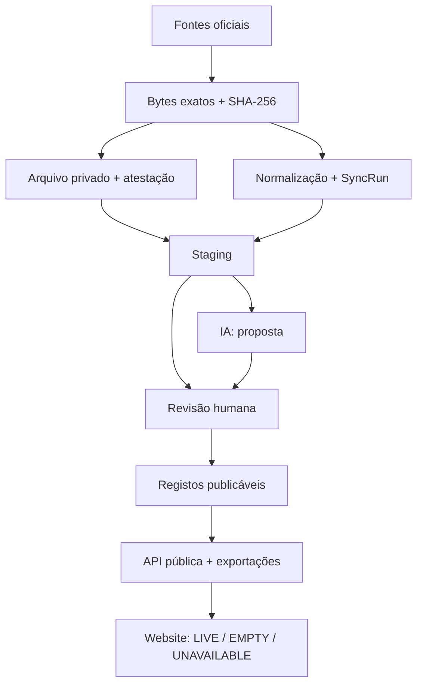

# Transparência Total / Fator Cívico — V5 em desenvolvimento

Plataforma cívica, neutra e sem fins lucrativos para acompanhar atividade política em
Portugal através de dados oficiais auditáveis. A partir da V5, o código-fonte é disponibilizado
para consulta, auditoria, execução, modificação e contribuição não comercial sob a licença
PolyForm Noncommercial 1.0.0. Esta modalidade é *source-available*, não *open-source* segundo a
definição da Open Source Initiative.

> **Estado do projeto:** a `v0.4.0` é a última versão pública estável e tem os gates técnicos e
> operacionais
> concluídos. Inclui arquivo PostgreSQL dos bytes oficiais, fotografias parlamentares versionadas e
> append-only, revisão humana por âmbito, API pública fail-closed, catálogo inicial do Programa do
> XXV Governo, páginas legais e cópia PostgreSQL externa cifrada no Backblaze B2 EU.
>
> O restauro dessa cópia foi comprovado num PostgreSQL 17 isolado: 13 migrações, 54 tabelas,
> 104 737 linhas e 32 objetos de arquivo, com estado operacional `HEALTHY`, RPO observado de
> 7 759 segundos e RTO de 37 segundos. A produção não foi usada como destino e a identidade privada
> temporária foi removida depois do ensaio.
>
> Consulte o [gate V4 → V5](docs/V4_TO_V5_RELEASE_GATE.md), o
> [runbook de recuperação](docs/DATABASE_RECOVERY.md) e o
> [runbook Backblaze B2 EU](docs/BACKUP_BACKBLAZE_B2.md). A tag `v0.4.0` deve apontar para o
> commit final desse fecho. A V5 começa pela governação de licença e pelo circuito editorial
> privado; esta branch não altera os dados aprovados da V4.

> **V5.1 a V5.45 preparadas; ativação remota de staging pendente:** o painel privado usa
> login por convite,
> MFA obrigatório, funções de administrador/revisor, comparação entre fonte atestada e JSON
> normalizado, versões e decisões append-only. A V5.2 acrescentou propostas parlamentares privadas,
> idempotentes e separadas por âmbito, com diferenças por identificador oficial exato. A V5.3 liga
> apenas um âmbito aprovado à porta pública V4, exige uma nova confirmação `ADMIN` e acrescenta
> revisão, auditoria, decisão e evento imutável numa única transação. Não existe publicação genérica
> nem automática. A V5.4 acrescentou retirada por categoria fechada, efeito público confirmado,
> histórico público redigido e correção obrigatoriamente seguida de nova revisão. A V5.5 organiza
> a leitura pública parlamentar com pesquisa, filtros, paginação e explicadores determinísticos,
> sem inferir temas, identidades, efeito jurídico ou impacto material. A V5.5.1 estabilizou a
> compatibilidade pública, a apresentação parlamentar e o contacto sem expor email pessoal. A
> V5.6 separa identidade, observações, mandatos, presenças, autoria, votos nominais e declarações
> através de portas de publicação independentes e cobertura explícita. A V5.9 acrescentou um
> diretório político paginado, pesquisável e fail-closed sem correspondência aproximada. A V5.10
> fechou defaults PostgreSQL inseguros e reforçou o inspetor read-only antes de staging. As áreas
> públicas permanecem em modo de compatibilidade fail-closed até o backend anunciar cada capacidade;
> recolher, gerar ou aprovar continua sem publicar qualquer dado. A V5.11
> documenta essa execução sem autorizar qualquer operação remota. A V5.12 integra um workflow
> manual e segregado para inventário read-only, migração de esquema e inspeção de
> prontidão em staging; não o executa, não configura o Supabase e não toca em dados reais. A V5.13
> e a V5.14 fecharam a autenticação MFA e a revisão privada de propostas DRE. A V5.15 acrescenta a
> publicação e retirada específicas de explicações com IA, sempre como decisão `ADMIN` separada,
> com fonte, hashes, rótulo público e histórico imutável. A V5.16 acrescenta antiabuso, revogação
> de alertas, cache pública por consentimento e E2E no CI. A V5.17 aplica CSP com `nonce` por pedido
> às rotas editoriais privadas e transforma a verificação automática WCAG A/AA das páginas
> públicas num gate permanente. A V5.18 acrescenta pesquisa global apenas sobre projeções
> publicadas, fonte, data, hash e cobertura em cada resultado, e um orçamento móvel Lighthouse
> baseado na mediana de três execuções. A V5.19 acrescenta a auditoria sanitizada de dados,
> segredos e privacidade da história e mantém a publicação pública bloqueada até existir uma
> decisão sobre o contacto pessoal histórico. A V5.20 limita o Promessómetro ao vocabulário
> editorial aprovado, recusa estados legados na projeção pública e explica que nenhum estado é
> uma previsão automática ou uma conclusão baseada apenas em ausência de dados. A V5.21 acrescenta
> uma matriz parlamentar por legislatura, âmbito, período observado e fotografia revista; uma
> fonte-candidata não conta como cobertura antes de arquivo, revisão e publicação próprios. A V5.22
> acrescenta o inventário privado e versionado das pastas parlamentares por legislatura, apenas por
> etiqueta e URL oficiais exatas, sem descarregar conjuntos históricos, criar casos editoriais ou
> publicar. A V5.23 exige esse catálogo pai exato e atestado antes de arquivar uma pasta e criar um
> manifesto privado apenas de ligações XML/JSON inequívocas; os ficheiros continuam por descarregar
> e não entram no circuito editorial. A V5.24 volta a provar catálogo e manifesto antes de
> descarregar e arquivar exatamente um recurso, com limite de tamanho e estado
> `ARCHIVED_UNPARSED`; não normaliza registos nem cria revisão ou publicação. A V5.25 lê
> exclusivamente esses bytes arquivados e inicia o backfill com uma
> fotografia privada de iniciativas por `source_id` oficial exato; duplicados divergentes, URLs
> externos ou conteúdo que não possa ser novamente derivado dos bytes são recusados, e nenhum caso
> editorial é criado. A V5.26 deriva dos mesmos bytes uma fotografia privada separada de votações:
> exige ID oficial, recusa datas, resultados ou posições contraditórias para o mesmo ID e mantém
> texto livre como `UNKNOWN`, sem associar pessoas ou partidos e sem publicar. A V5.27 acrescenta
> uma fotografia privada e versionada das fichas de deputados: usa `DepId`, conserva `GpId` e
> `DepCPId`, separa situações, grupos e cargos, exclui contactos e nunca transforma observação em
> mandato, perfil, revisão ou publicação. A V5.28 acrescenta o comparador privado dessas
> observações e cria apenas um caso `POLITICIAN_PROFILE` em `PENDING` por observação e `DepId`
> oficial exato. O browser não fornece o conteúdo normalizado, aprovar não cria uma pessoa ou
> mandato e não existe adaptador de publicação de perfis nessa entrega. A V5.29 acrescenta uma
> inspeção read-only por fotografia completa: todas as observações têm de coincidir com o
> manifesto, o arquivo e a versão aprovada reconstruída; uma revisão pública antiga bloqueia até
> existir reconciliação explícita. Mesmo uma fotografia pronta continua privada na V5.29. A V5.30
> acrescenta uma ação `ADMIN` com MFA que publica apenas a fotografia inteira numa única transação,
> liga identidades exclusivamente por `DepId` exato e recua tudo perante qualquer divergência. Não
> cria mandatos nem transforma siglas de grupos em filiações partidárias. A V5.31 permite retirar a
> fotografia em bloco, calcula o recuo público e preserva pessoas, fontes, versões e toda a prova
> anterior. A V5.32 prova que a mesma versão retirada nunca é reativada: uma republicação exige nova
> fonte arquivada, nova fotografia, novos processos e nova revisão; a pessoa só é reutilizada pelo
> mesmo `DepId` oficial exato. A V5.33 acrescenta candidatos privados de mandato por intervalo
> oficial e SHA-256 exatos; exige identidade publicada, círculo oficial e revisão humana da
> semântica, mas aprovação ainda cria zero mandatos e zero eventos públicos. A V5.34 acrescenta a
> publicação transacional ADMIN+MFA: guarda a observação, a posição e o SHA-256 do intervalo,
> acrescenta revisão `MANDATE`, auditoria, decisão e evento, e torna mandato e revisões append-only.
> A V5.35 acrescenta a retirada específica: nova revisão negativa, auditoria, decisão e evento numa
> transação `ADMIN` com MFA, sem apagar ou alterar o mandato, a pessoa ou a publicação original. A
> V5.36 abre a porta privada dos cargos parlamentares: cada `DepCargo` exige DepId, CarId, círculo,
> período, fonte e SHA-256 exatos, e uma aprovação ainda cria zero cargos ou publicações. A V5.37
> acrescenta a publicação transacional específica: o cargo fica numa estrutura própria,
> separado de `Mandate`, com revisão `PARLIAMENT_OFFICE`, auditoria, decisão e evento numa única
> transação ADMIN+MFA; cria zero pessoas, mandatos ou filiações e aparece separadamente na ficha
> pública. A V5.38 fecha a retirada append-only deste domínio: uma nova revisão negativa,
> auditoria, decisão e evento ocultam apenas o cargo ativo, preservando cargo, identidade,
> mandatos, fonte, versão e publicação originais. A V5.39 inicia o domínio de presenças por
> reunião plenária completa: arquiva os bytes oficiais, conserva cada BID e estado literal numa
> fotografia privada append-only e permite apenas uma proposta `PENDING` integral. Não usa nomes,
> não transforma faltas em incumprimento e aprovação cria zero sessões ou presenças públicas. A
> V5.40 acrescenta a publicação transacional da reunião integral: exige `ADMIN` com MFA, repete
> fonte, arquivo, versão, todos os BID e exatamente um mandato revisto por registo, acrescenta
> sessão, linhas, revisão, auditoria, decisão e evento ou recua tudo. A ficha pública mostra cada
> reunião com a respetiva fonte e SHA-256; não cria pessoas, mandatos ou filiações. A V5.41 fecha
> a retirada integral append-only: uma revisão negativa, auditoria, decisão e evento ocultam toda a
> reunião ativa sem apagar sessão, presenças, fonte, versão ou publicação original. Não existe
> retirada seletiva por deputado. A V5.42 inicia o domínio de autoria individual de iniciativas:
> deriva do mesmo JSON oficial arquivado uma fotografia privada por `IniId + idCadastro`, conserva
> SHA-256 por relação e só permite propostas `PENDING` reconstruídas no servidor. Nome e grupo são
> texto da fonte, não chaves de identidade ou filiação; autoria não é convertida em voto, apoio ou
> posição coletiva e esta entrega cria zero relações públicas. A V5.43 acrescenta a porta pública
> específica: uma ação `ADMIN` com MFA volta a provar `IniId`, `idCadastro`, relação `AUTHOR`,
> identidade, iniciativa já revista, dois arquivos e todos os hashes, acrescentando ligação,
> revisão, auditoria, decisão e evento ou revertendo tudo. Não cria pessoas, iniciativas ou
> filiações. A V5.44 fecha a retirada append-only: uma revisão negativa, auditoria, decisão e
> evento ocultam apenas a ligação ativa, preservando autoria, pessoa, iniciativa, duas fontes,
> versão e publicação originais. Não infere voto, apoio ou posição coletiva. A V5.45 fecha a prova
> dos votos nominais: guarda o identificador oficial individual numa nova fotografia de parser,
> exige igualdade exata com `people.source_id` e não faz backfill das linhas antigas. A publicação e
> a retirada continuam nos gates humanos V5.2 a V5.4; posições coletivas nunca entram no perfil. A
> ativação real continua dependente dos gates operacionais de staging. O código e os testes
> não executam estas operações sobre staging ou
> produção. O plano e a checklist
> de fecho estão em
> [Plano de conclusão da V5](docs/V5_RELEASE_PLAN.md) e
> [Checklist de conclusão da V5](docs/V5_RELEASE_CHECKLIST.md). Consulte também
> [Painel privado e fundação editorial V5.1](docs/V5_EDITORIAL_FOUNDATION.md),
> [Prontidão editorial V5.8 para staging](docs/V5_EDITORIAL_STAGING_READINESS.md),
> [Diretório político paginado V5.9](docs/V5_POLITICIAN_DIRECTORY.md),
> [Gate de ativação editorial V5.10](docs/V5_EDITORIAL_STAGING_ACTIVATION.md),
> [Plano de execução editorial em staging V5.11](docs/V5_EDITORIAL_STAGING_EXECUTION_PLAN.md),
> [Fundação do workflow de staging V5.12](docs/V5_STAGING_WORKFLOW_FOUNDATION.md),
> [Publicação responsável de explicações DRE V5.15](docs/V5_AI_PUBLICATION.md),
> [Endurecimento do candidato de release V5.16](docs/V5_RELEASE_HARDENING.md),
> [Gate público de segurança e acessibilidade V5.17](docs/V5_PUBLIC_QUALITY_GATE.md),
> [Pesquisa global e desempenho móvel V5.18](docs/V5_GLOBAL_SEARCH_AND_PERFORMANCE.md),
> [Auditoria de privacidade e segredos V5.19](docs/V5_RELEASE_PRIVACY_AUDIT.md),
> [Vocabulário editorial do Promessómetro V5.20](docs/V5_PROMESSOMETRO_VOCABULARY.md),
> [Matriz e preenchimento histórico parlamentar V5.21](docs/V5_PARLIAMENT_COVERAGE_AND_BACKFILL.md),
> [Catálogo privado de fontes parlamentares V5.22](docs/V5_PARLIAMENT_SOURCE_CATALOGUE.md),
> [Manifesto privado de recursos parlamentares V5.23](docs/V5_PARLIAMENT_RESOURCE_MANIFEST.md),
> [Arquivo privado de um recurso parlamentar V5.24](docs/V5_PARLIAMENT_RESOURCE_ARCHIVE.md),
> [Normalização privada de iniciativas parlamentares V5.25](docs/V5_PARLIAMENT_RESOURCE_NORMALIZATION.md),
> [Normalização privada de votações parlamentares V5.26](docs/V5_PARLIAMENT_VOTE_NORMALIZATION.md),
> [Observações privadas de deputados V5.27](docs/V5_PARLIAMENT_DEPUTY_OBSERVATIONS.md),
> [Observações de deputados no circuito editorial V5.28](docs/V5_POLITICIAN_PROFILE_EDITORIAL.md),
> [Prontidão de publicação dos perfis V5.29](docs/V5_POLITICIAN_PROFILE_PUBLICATION_READINESS.md),
> [Publicação transacional da fotografia de perfis V5.30](docs/V5_POLITICIAN_PROFILE_SNAPSHOT_PUBLICATION.md),
> [Retirada imutável da fotografia de perfis V5.31](docs/V5_POLITICIAN_PROFILE_SNAPSHOT_WITHDRAWAL.md),
> [Republicação por nova fotografia imutável V5.32](docs/V5_POLITICIAN_PROFILE_SNAPSHOT_REPUBLICATION.md),
> [Intervalos oficiais no circuito editorial de mandatos V5.33](docs/V5_POLITICIAN_MANDATE_EDITORIAL.md),
> [Publicação transacional de mandatos V5.34](docs/V5_POLITICIAN_MANDATE_PUBLICATION.md),
> [Retirada transacional e imutável de mandatos V5.35](docs/V5_POLITICIAN_MANDATE_WITHDRAWAL.md),
> [Cargos parlamentares oficiais no circuito editorial V5.36](docs/V5_POLITICIAN_OFFICE_EDITORIAL.md),
> [Publicação transacional de cargos parlamentares V5.37](docs/V5_POLITICIAN_OFFICE_PUBLICATION.md),
> [Retirada transacional e imutável de cargos parlamentares V5.38](docs/V5_POLITICIAN_OFFICE_WITHDRAWAL.md),
> [Presenças parlamentares por reunião no circuito editorial V5.39](docs/V5_POLITICIAN_ATTENDANCE_EDITORIAL.md),
> [Publicação transacional de presenças por reunião V5.40](docs/V5_POLITICIAN_ATTENDANCE_PUBLICATION.md),
> [Retirada integral e imutável de presenças por reunião V5.41](docs/V5_POLITICIAN_ATTENDANCE_WITHDRAWAL.md),
> [Autoria individual de iniciativas no circuito editorial V5.42](docs/V5_POLITICIAN_INITIATIVE_AUTHORSHIP.md),
> [Publicação transacional de autoria individual V5.43](docs/V5_POLITICIAN_INITIATIVE_AUTHORSHIP_PUBLICATION.md),
> [Retirada imutável de autoria individual V5.44](docs/V5_POLITICIAN_INITIATIVE_AUTHORSHIP_WITHDRAWAL.md),
> [Prova persistida de identidade em votos nominais V5.45](docs/V5_POLITICIAN_NOMINAL_VOTE_IDENTITY.md),
> [Adaptador parlamentar V5.2](docs/V5_PARLIAMENT_EDITORIAL_ADAPTER.md) e
> [Publicação parlamentar por âmbito V5.3](docs/V5_PARLIAMENT_SCOPE_PUBLICATION.md),
> [Retirada parlamentar imutável V5.4](docs/V5_PARLIAMENT_WITHDRAWAL.md) e
> [Experiência pública parlamentar V5.5](docs/V5_PARLIAMENT_PUBLIC_EXPERIENCE.md) e
> [Perfis políticos auditáveis V5.6](docs/V5_POLITICIAN_PROFILES.md).

## Princípios

- **Fonte antes da conclusão:** todo o facto publicado conserva URL oficial, data de recolha e
  hash SHA-256 do documento.
- **Ausência não é incumprimento:** lacunas do portal de origem são mostradas como dados
  indisponíveis.
- **Não atribuir por inferência:** uma posição de grupo parlamentar nunca é convertida num voto
  nominal de um deputado.
- **IA não é fonte:** resumos automáticos são rotulados, revistos e ligados ao texto integral.
- **Ligação não é acusação:** uma coincidência de nome, cargo ou identificador cria apenas um
  candidato privado de revisão; nunca prova conflito, benefício, corrupção ou ilícito.
- **Histórico imutável:** correções acrescentam versões e eventos de auditoria; não apagam o
  fundamento anterior.
- **Privacidade mínima:** o website público não usa analítica, publicidade, cookies não essenciais,
  notificações sem consentimento ou perfis de visitantes.

O nome “Transparência Total” descreve a ambição. Nenhum sistema pode garantir a completude de
uma fonte pública; a plataforma torna também visíveis falhas, atrasos e limites conhecidos.

## O que está incluído na V4

- Persistência transacional das fotografias parlamentares e BASE, com `SyncRun`, contagens, avisos
  e versão do coletor. Correções de parser criam uma nova fotografia e preservam a anterior.
- `ParliamentaryMembershipSnapshot`: regista “observado na fonte em”, sem inventar uma data de
  início de mandato quando o dataset não a fornece.
- API de leitura pública para estado dos dados, diretório e perfil de políticos, Promessómetro e
  atividade parlamentar. Conjuntos de investigação permanecem privados até terem revisão efetiva.
- Três modos públicos explícitos: `LIVE`, `EMPTY` e `UNAVAILABLE`; não existe fallback de
  demonstração no domínio oficial.
- Promoção editorial por linha de comando com confirmação explícita, teste de dependências,
  `DataPublicationReview` e `AuditEvent`; a decisão pode ser retirada sem apagar o histórico.
- A persistência BASE exige `ENVIRONMENT=staging`, confirmação explícita, arquivo atestado e carga
  em lote append-only; não cria contratos públicos, entidades, correspondências ou revisões.
- Arquivo privado content-addressed dos bytes oficiais, com recibo verificado antes da persistência
  parlamentar, `SourceArchiveAttestation` imutável e projeções públicas em modo fail-closed.
- Ferramentas separadas para atestar um `SourceDocument` histórico em staging e para verificar o
  objeto em modo exclusivamente de leitura; nenhuma destas operações cria revisão ou publicação.
- Recolha conjunta de reuniões observadas, iniciativas e votações da Assembleia da República,
  arquivo dos bytes antes da normalização, manifesto com SHA-256 normalizado e revisão humana
  separada para atividade e posições de voto.
- O normalizador parlamentar V5 só associa pessoas ou grupos a registos de voto quando a própria
  fonte fornece um identificador oficial exato; siglas e nomes permanecem apenas rótulos da fonte.
- API e página pública de atividade parlamentar que selecionam uma única fotografia aprovada por
  legislatura, permitem pesquisa, filtros e paginação e mostram lacunas sem preencher dados por
  inferência.

- Frontend Next.js responsivo. Manifesto e modo offline estão disponíveis apenas por escolha
  explícita e reversível no rodapé; alertas regionais exigem consentimento informado e podem ser
  alterados e apagados no navegador e no backend.
- Pipeline do Investigador Cívico preservado na API, sem página pública até existir um conjunto
  de relações efetivamente revisto.
- Componentes de grafo e de comparação preservados para trabalho futuro, sem exposição pública
  enquanto não existirem relações e pares comparáveis aprovados.
- Guia do Cidadão com perfil genérico, cálculo determinístico separado da explicação por IA e
  alertas com fontes, vigência, ressalvas e incertezas.
- Área pública de explicações DRE que mostra apenas versões aprovadas e publicadas separadamente por
  um administrador com MFA; identifica a IA, expõe fonte, datas e hashes e conserva retiradas no
  histórico sem apresentar previsões ou recomendações eleitorais.
- Formulário de direito de resposta com recibo temporal e hashes SHA-256 sem apagar o original.
- Exportação em JSON/CSV de contratos, grafo, notícias, alertas e direitos de resposta, sempre com
  proveniência e condições de reutilização da fonte.
- Perfil de político com cobertura explícita por área, observações separadas de mandatos, votos
  individuais apenas quando nominais e portal institucional de declarações separado da prova
  individual.
- Promessómetro filtrável com cinco estados, incluindo “Por verificar”, catálogo inicial do
  programa e fundamentação oficial por medida avaliada.
- Infraestrutura Web Push sem registo automático; só envia um `CitizenAlert` com a última revisão
  pública positiva, estado publicado, vigência válida e arquivo oficial atestado.
- API FastAPI com documentação OpenAPI, CORS restrito e endpoints de saúde.
- Descoberta e normalização resiliente dos datasets da Assembleia da República e dos recursos
  anuais JSON/XML/ZIP do Portal BASE publicados através do dados.gov.pt.
- Correspondência protegida por HMAC para identificadores pessoais e correspondência exata de
  entidades; não existe fuzzy matching nem publicação automática.
- Leitura de diplomas e RSS configurável do Diário da República.
- Índice de recursos públicos da Entidade para a Transparência.
- Dois pipelines OpenAI Responses API com saída Pydantic estruturada: resumo de diplomas e Guia
  do Cidadão. Ambos exigem revisão humana e o modelo pode abster-se.
- Esquema PostgreSQL/Prisma para pessoas, mandatos, sessões, votos, leis, promessas, fontes,
  notícias, contratos, organizações, relações, processos, respostas, impactos, alertas e auditoria.
- Docker local, CI GitHub Actions e modelos de publicação Vercel, Render e Fly.io.

## Arquitetura



O frontend e o backend são serviços separados. O frontend só consome a API pública; chaves,
coletores, revisão e envio push ficam no backend. Consulte [Arquitetura](docs/ARCHITECTURE.md),
[Neutralidade](docs/NEUTRALITY.md), [Fontes](docs/DATA_SOURCES.md) e
[Governação de IA](docs/AI_GOVERNANCE.md), [Governação V2](docs/V2_GOVERNANCE.md) e
[circuito de dados reais V3](docs/V3_LIVE_DATA.md), além do
[arquivo privado de prova V4.1](docs/V4_RAW_EVIDENCE.md) e do
[staging BASE append-only V4.2](docs/V4_BASE_STAGING.md), bem como do
[pipeline parlamentar V4](docs/V4_PARLIAMENT_PIPELINE.md), das
[operações de produção](docs/V4_PRODUCTION_OPERATIONS.md) e do
[gate V4 → V5](docs/V4_TO_V5_RELEASE_GATE.md), do
[painel privado e fundação editorial V5.1](docs/V5_EDITORIAL_FOUNDATION.md), do
[adaptador parlamentar V5.2](docs/V5_PARLIAMENT_EDITORIAL_ADAPTER.md), do
[adaptador de publicação parlamentar V5.3](docs/V5_PARLIAMENT_SCOPE_PUBLICATION.md), do
[circuito de retirada parlamentar V5.4](docs/V5_PARLIAMENT_WITHDRAWAL.md), do
[explorador parlamentar público V5.5](docs/V5_PARLIAMENT_PUBLIC_EXPERIENCE.md), do
[plano de conclusão da V5](docs/V5_RELEASE_PLAN.md), da
[checklist de conclusão da V5](docs/V5_RELEASE_CHECKLIST.md), do
[procedimento de prontidão editorial V5.8](docs/V5_EDITORIAL_STAGING_READINESS.md), do
[diretório político paginado V5.9](docs/V5_POLITICIAN_DIRECTORY.md), do
[gate de ativação editorial V5.10](docs/V5_EDITORIAL_STAGING_ACTIVATION.md), do
[plano de execução editorial em staging V5.11](docs/V5_EDITORIAL_STAGING_EXECUTION_PLAN.md), do
[workflow editorial segregado de staging V5.12](docs/V5_STAGING_WORKFLOW_FOUNDATION.md), do
[circuito público responsável de IA V5.15](docs/V5_AI_PUBLICATION.md), do
[runbook de recuperação](docs/DATABASE_RECOVERY.md), do
[backup cifrado Backblaze B2 EU](docs/BACKUP_BACKBLAZE_B2.md), além do
[modelo de AIPD/RGPD](docs/DPIA_TEMPLATE.md).

## Estrutura do projeto

```text
transparencia-total/
├── app/                         # Rotas e layout Next.js App Router
│   ├── direito-de-resposta/
│   ├── atividade-parlamentar/
│   ├── guia-cidadao/
│   ├── investigador/             # Redireciona para metodologia enquanto não há dados revistos
│   ├── metodologia/
│   ├── politicos/               # Diretório e perfis por slug
│   └── promessas/
├── components/                  # Navegação, guia, perfis, Promessómetro e módulos opcionais
├── lib/                         # Cliente tipado da API e catálogo oficial versionado
├── public/
│   ├── icons/                   # Ícones PWA 96/192/512
│   ├── manifest.json
│   ├── offline.html
│   └── sw.js                    # Cache público opt-in; exclui rotas privadas e respostas no-store
├── types/                       # Contratos TypeScript da interface
├── backend/
│   ├── app/
│   │   ├── api/routes/          # Leitura pública, Parlamento, DRE, EPT, IA, push
│   │   ├── core/                # Configuração, logs e segurança SSRF
│   │   ├── models/              # Contratos Pydantic
│   │   ├── repositories/        # Acesso assíncrono ao PostgreSQL
│   │   └── services/            # BASE, Parlamento, IA, prova, resposta e Web Push
│   ├── scripts/                 # Sincronização, revisão/publicação e resumo DRE
│   └── tests/                   # Fixtures oficiais anonimizadas e testes
├── db/client.ts                 # Prisma 7 com adapter PostgreSQL
├── prisma/
│   ├── migrations/              # Migrações versionadas
│   ├── schema.prisma            # Modelo relacional completo
│   └── seed.ts                  # Seed mínimo de catálogo
├── docs/                        # Método, RGPD/AIPD, fontes, IA, arquitetura e publicação
├── tests/                       # Contratos PWA/frontend
├── .github/workflows/ci.yml
├── docker-compose.yml
├── render.yaml
├── fly.toml.example
└── vercel.json
```

Os ficheiros `.openai/`, `build/`, `worker/` e os scripts `sites-*` suportam o preview público
do projeto. A publicação Next.js normal usa `npm run build:next`.

## Modelo de dados V4

O esquema integral está em `prisma/schema.prisma`. A V3 acrescenta a migração
`prisma/migrations/20260801020000_v3_live_data/migration.sql` e a V4.1 acrescenta
`prisma/migrations/20260803070000_v4_raw_evidence_archive/migration.sql`. A V4.2 acrescenta
`prisma/migrations/20260803080000_v4_base_staging/migration.sql`. A fotografia parlamentar
versionada é concluída por
`prisma/migrations/20260808090000_v4_parliament_activity_snapshots/migration.sql`; todas as
migrações anteriores continuam necessárias e são aplicadas por ordem.

| Área pedida | Modelos principais | Regra de publicação |
|---|---|---|
| Notícias | `NewsArticle`, `NewsEvidence`, `NewsEntityMention` | Menções automáticas ficam pendentes; prova oficial é separada |
| Contratos públicos | `PublicContract`, `PublicContractParty`, `ContractMatchReview` | Candidatos de cruzamento nunca entram na API pública |
| Grafo de interesses | `InterestEntity`, `Organisation`, `InterestRelationship` | Cada aresta tem tipo, datas, fonte, verificação e revisão |
| Discurso vs. voto | `StatementVoteComparison`, `CoherenceSnapshot` | Só pares comparáveis entram no denominador |
| Processos | `JudicialCase`, `JudicialCaseSubject` | Estado processual controlado e fonte do órgão competente |
| Guia e alertas | `CitizenImpactRule`, `CitizenAlert` | Regra determinística, vigência, território e fonte obrigatórios |
| Retificação | `RightOfReply`, `AuditEvent` | Acrescenta versão e hashes; não apaga o alvo |
| RGPD | `ProtectedIdentifierDigest`, `DataPublicationReview` | HMAC e decisão de necessidade/proporcionalidade |
| Fotografias parlamentares | `ParliamentActivitySnapshot`, `ParliamentaryMembershipSnapshot`, `ParliamentarySession`, `ParliamentaryInitiative`, `VoteEvent` | Manifesto e factos são append-only; uma decisão humana por âmbito escolhe a fotografia pública |
| Prova bruta | `SourceArchiveAttestation`, `AuditEvent` | Objeto privado e atestação são obrigatórios, mas nunca equivalem a revisão ou publicação |
| Staging BASE | `BaseStagingBatch`, `BaseContractSnapshot`, `BaseContractPartySnapshot` | Append-only, privado e sem ligação automática às projeções públicas |

`SourceDocument` continua a ser a raiz de proveniência e `AuditEvent` o rasto de decisões. Os
`CHECK` SQL adicionais impedem sujeitos ambíguos, arestas reflexivas, montantes negativos, métricas
fora do intervalo e hashes de resposta inválidos.

## Pré-requisitos

- Node.js 24 e npm 10+
- Python 3.13.15
- Docker com Compose, recomendado para PostgreSQL local
- Git

A revisão exata do Python é definida em [`.python-version`](.python-version). CI, Render e a imagem
Docker têm de coincidir com esse ficheiro; o backend suporta apenas a série `3.13`. Consulte a
[política de runtime Python](docs/PYTHON_RUNTIME_POLICY.md) antes de atualizar a versão.

## Instalação local, passo a passo

### 1. Obter o projeto e configurar o ambiente

```bash
git clone https://github.com/DxMaxi/transparencia-total-open-source.git
cd transparencia-total
cp .env.example .env
```

Edite `OFFICIAL_USER_AGENT` com o URL real do repositório e um contacto técnico. Não coloque
segredos em variáveis `NEXT_PUBLIC_*`. Deixe `RAW_ARCHIVE_ROOT` vazio para recolhas sem
persistência; antes de usar `--persist`, defina um caminho absoluto privado fora do repositório.

### 2. Instalar o frontend e o Prisma

```bash
npm ci
```

### 3. Iniciar PostgreSQL

```bash
docker compose up -d postgres
docker compose ps
```

O `.env.example` coincide com o utilizador, palavra-passe e base de dados do Compose.

### 4. Gerar o cliente e aplicar o esquema

```bash
npm run db:generate
npm run db:deploy
npm run db:seed
```

Durante desenvolvimento de uma alteração ao esquema use `npm run db:migrate -- --name nome` e
inclua a migração criada no pull request.

### 5. Criar o ambiente Python

Linux/macOS:

```bash
python3.13 -m venv .venv
source .venv/bin/activate
python backend/scripts/check_python_runtime_policy.py --check-interpreter
python -m pip install --upgrade pip
python -m pip install -e './backend[dev]'
```

Windows PowerShell:

```powershell
py -3.13 -m venv .venv
.venv\Scripts\Activate.ps1
python backend/scripts/check_python_runtime_policy.py --check-interpreter
python -m pip install --upgrade pip
python -m pip install -e './backend[dev]'
```

### 6. Iniciar a API

```bash
npm run api:dev
```

Verifique `http://localhost:8000/api/v1/health` e, em desenvolvimento,
`http://localhost:8000/docs`.

### 7. Iniciar o frontend

Noutro terminal:

```bash
npm run dev:next
```

Abra `http://localhost:3000`. O Service Worker só é registado quando escolher “Ativar modo
offline” no rodapé e pode ser removido, juntamente com os caches do projeto, no mesmo controlo.

## API principal

| Método | Rota | Finalidade |
|---|---|---|
| `GET` | `/api/v1/health` | Saúde e configuração não sensível |
| `GET` | `/api/v1/public/data-status` | Modo, contagens publicáveis e última execução por fonte |
| `GET` | `/api/v1/public/politicians` | Diretório de perfis aprovados |
| `GET` | `/api/v1/public/politicians/{slug}` | Perfil V5.6, cobertura, mandatos e atividade individual aprovada |
| `GET` | `/api/v1/public/promises` | Medidas com prova e última revisão aceite |
| `GET` | `/api/v1/public/investigator` | Grafo e comparações publicadas e verificadas |
| `GET` | `/api/v1/public/parliament/sessions` | Reuniões observadas da fotografia de atividade aprovada |
| `GET` | `/api/v1/public/parliament/initiatives` | Iniciativas da fotografia de atividade aprovada |
| `GET` | `/api/v1/public/parliament/votes` | Votações da fotografia de votos aprovada |
| `GET` | `/api/v1/parliament/deputies?legislature=XVII` | Descobrir e normalizar deputados; exige `X-Admin-Key` |
| `GET` | `/api/v1/parliament/votes?legislature=XVII` | Descobrir e normalizar votações; exige `X-Admin-Key` |
| `GET` | `/api/v1/dre/document?source_url=…` | Extrair um diploma oficial autorizado; exige `X-Admin-Key` |
| `GET` | `/api/v1/dre/rss` | Ler o RSS configurado em `DRE_RSS_URL`; exige `X-Admin-Key` |
| `GET` | `/api/v1/transparency-entity/resources` | Indexar recursos públicos da EPT; exige `X-Admin-Key` |
| `GET` | `/api/v1/base/resources/{year}` | Descobrir o recurso anual oficial BASE |
| `GET` | `/api/v1/base/contracts/preview?year=2026&limit=25` | Pré-visualizar contratos; exige `X-Admin-Key` |
| `POST` | `/api/v1/editorial/ai/dre-proposals` | Criar proposta privada `PENDING` a partir de snapshot DRE atestado; exige staff com MFA |
| `POST` | `/api/v1/ai/summaries` | Rota legada desativada (`410`); não gera nem publica |
| `POST` | `/api/v1/ai/civic-guide` | Rota legada desativada (`410`) até ter circuito próprio persistente |
| `POST` | `/api/v1/push/subscriptions` | Guardar subscrição e filtros regionais |
| `POST` | `/api/v1/push/broadcast` | Enviar um alerta já publicado pelo respetivo ID; exige `X-Admin-Key` |
| `POST` | `/api/v1/right-of-reply` | Registar contestação com recibo e hashes |
| `GET` | `/api/v1/open-data/{dataset}.json` | Exportar registos publicados e verificados |
| `GET` | `/api/v1/open-data/{dataset}.csv` | Exportar os mesmos registos em CSV |

### Recolha e publicação parlamentar

Execute dentro de `backend/`, com o ambiente virtual ativo. Os comandos antigos continuam úteis
para pré-visualizações locais:

```bash
cd backend
python -m scripts.sync_parliament deputies --legislature XVII --output ../data/deputies.json
python -m scripts.sync_parliament votes --legislature XVII --output ../data/votes.json
```

A persistência de votos pelo comando antigo é recusada. Para conservar deputados e a fotografia
completa de atividade no PostgreSQL privado:

```bash
python -m scripts.sync_parliament deputies --legislature XVII --persist
python -m scripts.sync_parliament_activity --legislature XVII
```

Os bytes exatos são guardados de forma content-addressed em `raw_source_objects`, atestados e só
depois materializados. A operação não publica. Para inspecionar a fotografia mais recente sem
escrever uma decisão:

```bash
python -m scripts.review_parliament_activity --legislature XVII
```

O relatório devolve URL, SHA-256 da fonte, SHA-256 normalizado e quatro contagens. A publicação
exige repetir exatamente esses valores e uma fundamentação humana:

```bash
python -m scripts.review_parliament_activity --legislature XVII \
  --publish --scope all \
  --source-sha256 SHA_FONTE \
  --normalised-sha256 SHA_NORMALIZADO \
  --expected-sessions N --expected-initiatives N \
  --expected-votes N --expected-vote-records N \
  --reviewer revisor-01 \
  --rationale "Fonte, cobertura e limitações confirmadas na revisão editorial." \
  --confirm-source-reviewed
```

Use `--withdraw` para acrescentar uma decisão negativa sem apagar a fotografia nem a decisão
anterior. `activity` controla reuniões/iniciativas; `votes` controla votações. Perfis e Investigador
usam o mesmo gate de fotografia e só mostram votos individuais quando a fonte os identifica
explicitamente.

Os URLs dos datasets do Parlamento podem mudar. O coletor navega o catálogo oficial e escolhe o
JSON da legislatura em vez de codificar um URL opaco. Para uma integração controlada, defina
`PARLAMENTO_DEPUTIES_URL` e `PARLAMENTO_VOTES_URL` explicitamente.

### Contratos públicos do Portal BASE

O caminho normal usa os recursos anuais abertos que o IMPIC publica no dados.gov.pt. A API direta
de grande volume do Portal BASE só deve ser configurada quando a organização tiver registo e
autorização prévia do IMPIC; o coletor não tenta contornar esse controlo.

Defina primeiro um segredo aleatório com pelo menos 32 caracteres em
`PROTECTED_IDENTIFIER_PEPPER`. Gere cada digest sem ecoar nem guardar o NIF/NIPC em claro:

```bash
cd backend
python -m scripts.protect_identifier
```

Crie depois um ficheiro privado de atores fora do repositório, contendo apenas os HMAC gerados:

```json
[
  {
    "person_id": "uuid-interno",
    "public_name": "Nome público",
    "public_role": "DEPUTY",
    "official_role_source_url": "https://www.parlamento.pt/DeputadoGP/Paginas/default.aspx",
    "protected_nif_digest": "64-carateres-hexadecimais-do-hmac",
    "official_associations": [
      {
        "organisation_name": "Empresa publicamente associada",
        "protected_nipc_digest": "64-carateres-hexadecimais-do-hmac",
        "official_evidence_url": "https://diariodarepublica.pt/"
      }
    ]
  }
]
```

O exemplo é apenas estrutural; substitua valores, digests e URLs por prova oficial real. Use o
mesmo pepper para gerar os digests e para executar a recolha. O esquema rejeita os campos antigos
com identificadores em claro. Tanto a entrada de atores como a saída privada são recusadas se o
caminho ficar dentro do repositório. O comando também recusa substituir um ficheiro de revisão já
existente: cada execução conserva uma versão separada. Execute:

```bash
cd backend
python -m scripts.sync_base_contracts \
  --year 2026 \
  --actors-file ../../transparencia-total-private/public-actors.json \
  --output ../../transparencia-total-private/base-2026-review.json
```

O resultado omite identificadores e digests, marca todos os cruzamentos como `PENDING_REVIEW` e
inclui o URL, data e SHA-256 do dump efetivamente descarregado, a prova do cargo e, quando
aplicável, a prova oficial da associação. O URL direto do contrato permanece metadado auxiliar,
sem herdar o hash do dump. Nome normalizado é usado apenas em igualdade exata; não há semelhança
aproximada. Use `--limit 25` em ensaios ou `--resource-url` apenas para um recurso oficial permitido.

Sem `--persist`, este comando produz apenas o ficheiro JSON privado de pré-visualização/revisão. Na
V4.2, uma fotografia anual completa pode ser carregada em staging depois de confirmar o destino da
base por um meio independente:

```bash
ENVIRONMENT=staging \
RAW_ARCHIVE_ROOT=/caminho/absoluto/privado/fora-do-repositorio \
python -m scripts.sync_base_contracts \
  --year 2026 \
  --output /caminho/privado/base-2026-review.json \
  --persist \
  --confirm-staging
```

O arquivo é verificado antes da ligação à base e a carga escreve apenas
`BaseStagingBatch`, `BaseContractSnapshot` e `BaseContractPartySnapshot`. `--limit` não pode ser
combinado com persistência. O comando não cria `PublicContract`, entidades, correspondências,
revisões ou publicação. Inspecione depois apenas metadados e contagens com:

```bash
python -m scripts.inspect_base_staging --year 2026
```

O ficheiro de atores é opcional quando se pretende apenas pré-visualizar contratos sem produzir
candidatos de correspondência. Identificadores fiscais presentes na fonte não são guardados
automaticamente como NIPC: a distinção entre pessoa singular e coletiva exige prova e revisão
próprias.

### Revisão e promoção para a API pública

Antes desta etapa, confirme a fonte original, identidade, necessidade, proporcionalidade e regras
editoriais. A publicação exige uma confirmação explícita:

```bash
cd backend
python -m scripts.review_publication PERSON person_id \
  --publish \
  --reviewer revisor-01 \
  --rationale "Identidade e mandato observável confirmados na fonte oficial" \
  --confirm-source-reviewed
```

Tipos aceites: `PERSON`, `MANDATE`, `ASSET_DECLARATION`, `PROMISE`, `PUBLIC_CONTRACT`,
`INTEREST_ENTITY` e `INTEREST_RELATIONSHIP`. Uma relação só pode ser promovida depois de ambos os
nós estarem verificados e publicados. Uma declaração exige ainda
`--confirm-legal-basis-reviewed`, fonte da Entidade para a Transparência e arquivo atestado; uma
ligação geral ao portal nunca é prova individual. Para retirar sem apagar o histórico, use
`--withdraw` com nova fundamentação. Cada decisão acrescenta `DataPublicationReview` e
`AuditEvent`. Consulte [Perfis políticos auditáveis V5.6](docs/V5_POLITICIAN_PROFILES.md).

### Modos visíveis no website

| Modo | Significado |
|---|---|
| `LIVE` | A API respondeu e existem registos aprovados; são mostrados dados reais com fonte |
| `EMPTY` | A base está ligada, mas nenhum registo cumpre ainda a regra de publicação |
| `UNAVAILABLE` | A API configurada não respondeu; não se presume que os dados estão atualizados |

## Pipeline de IA

A geração de IA continua desligada por omissão. Desligar novas gerações não apaga uma explicação
anteriormente revista e publicada. O circuito V5 aceita apenas um `snapshot_id` DRE já recolhido,
concluído e ligado a um arquivo oficial atestado.
Uma pessoa da equipa editorial autenticada com MFA confirma que pede uma proposta privada. O
resultado fica numa versão editorial imutável com estado `PENDING`, origem `AI`, modelo, versão e
hash do prompt, hashes da entrada e saída, documento usado e indicação de truncagem. A identidade
humana fica registada na decisão de submissão; a IA nunca é revisor nem fonte.

Pedidos iguais reutilizam a mesma proposta sem chamar novamente o modelo. Um bloqueio PostgreSQL
impede gerações simultâneas entre instâncias, e cada tentativa conta para o limite diário antes da
chamada externa. Tentativas e resultados são acrescentados ao histórico técnico sem guardar o
texto do documento nesse evento. Aprovar um processo não o projeta no site público. A V5.15 exige
uma segunda decisão de um `ADMIN` com MFA, volta a validar fonte, atestação, texto, âncoras e hashes e
acrescenta revisão pública, auditoria, decisão e evento na mesma transação. Essa publicação não chama
o modelo.

A página `/explicacoes` apresenta exclusivamente versões que passam novamente todas essas provas.
Cada ficha declara que a IA não é fonte, não é notícia automática, não prevê efeitos futuros e não
recomenda partidos ou sentido de voto. Uma retirada acrescenta novo histórico, mostra **dados
indisponíveis** na consulta ativa e permite correção apenas através de nova versão `PENDING`, nova
revisão e nova publicação.

As rotas antigas `/api/v1/ai/summaries` e `/api/v1/ai/civic-guide`, bem como o comando direto
`scripts.summarize_dre`, estão fechados para impedir respostas não persistidas. A ativação do
fornecedor deve ocorrer primeiro em staging, com uma chave restrita no backend e ensaios editoriais
controlados:

```dotenv
AI_PROVIDER=openai
OPENAI_API_KEY=sk-...
OPENAI_MODEL=gpt-5.6
OPENAI_STORE=false
AI_DAILY_GENERATION_LIMIT=20
AI_REQUEST_TIMEOUT_SECONDS=90
```

O resumo DRE usa a Responses API com Structured Outputs/Pydantic. Segmenta textos longos e devolve
campos separados para mudanças, pessoas afetadas, prazos, direitos, incertezas, glossário e âncoras.
O servidor verifica que as referências das âncoras existem literalmente na fonte ou que houve uma
abstenção explícita. Esta verificação não prova que a interpretação está correta: a comparação
humana integral continua obrigatória.

`OPENAI_STORE=false` é imposto pelo servidor. Segundo a política oficial do fornecedor, isto não é
uma promessa de retenção zero: por omissão podem existir registos de monitorização de abuso por até
30 dias. Só se enviam documentos públicos, nunca dados de utilizadores, identificadores protegidos,
credenciais ou conteúdo editorial privado. Consulte a [política oficial de controlos de dados da
API OpenAI](https://developers.openai.com/api/docs/guides/your-data#default-usage-policies-by-endpoint).

O Guia do Cidadão usa uma instrução independente, versionada em
`backend/app/services/civic_guide.py`. O endpoint recebe apenas um perfil genérico e uma lista de
`VerifiedImpactFact` já revista. Cálculos fiscais, elegibilidade e regras territoriais são
determinísticos e executados fora do LLM; o modelo apenas os explica. A resposta é rejeitada se
citar um `fact_id` não fornecido. Dados em falta produzem abstenção explícita, não uma estimativa.

Nenhum fornecedor ou prompt garante “0% de viés” ou “100% de precisão”. A blindagem real combina
fontes permitidas, esquema fechado, validação de citações, versionamento, teste adversarial,
revisão humana e possibilidade de não responder.

Boletins mensais, anuais e de mandato devem ser compostos exclusivamente a partir de resumos já
aprovados e listar todos os diplomas incluídos e excluídos.

## Publicação, RGPD e prova

- O pipeline de contratos tem três zonas: ingestão bruta, candidatos privados de correspondência e
  registos publicáveis. Só a última alimenta a API aberta.
- Apenas titulares de cargos públicos dentro do âmbito publicado e com prova oficial do cargo são
  elegíveis. Ser PEP não é indício de ilícito e não autoriza tratamento ilimitado.
- O pipeline de correspondência trata qualquer identificador fiscal da fonte como protegido:
  converte-o imediatamente para HMAC com pepper e nunca o exporta ou guarda em claro. Um NIPC de
  pessoa coletiva só pode ser mostrado noutro contexto depois de necessidade, natureza coletiva e
  base jurídica terem sido verificadas separadamente.
- Moradas, contactos, assinaturas, localização exata, dados familiares e categorias especiais são
  excluídos por omissão. A necessidade e proporcionalidade de qualquer exceção têm de ficar
  documentadas numa AIPD.
- Uma notícia serve para descoberta e contexto. Alegações ou estados judiciais publicáveis exigem
  documento do Ministério Público, tribunal, Tribunal de Contas ou outro órgão competente.
- O direito de resposta acrescenta uma declaração e eventos de auditoria; nunca reescreve o
  documento, hash ou conclusão original. A identidade e a prova são verificadas antes da publicação.
- As exportações aceites são `contracts`, `interest-graph`, `news`, `citizen-alerts` e
  `rights-of-reply`, com paginação e limite configurável. Candidatos de correspondência e campos
  protegidos ficam sempre fora.

Antes de tratar dados reais, conclua uma AIPD, revisão por encarregado de proteção de dados e
aconselhamento jurídico português independente. O código fornece controlos técnicos; não constitui
parecer jurídico nem, por si só, prova conformidade.

## PWA e notificações push opcionais

O manifesto está publicado, mas visitar o website não regista `public/sw.js`. O rodapé apresenta
uma escolha explícita para ativar o modo offline e outra para anular o registo e apagar apenas
caches com o prefixo `transparencia-total-`. Rotas `/admin`, `/auth` e `/api`, pedidos com
autorização e respostas `private`/`no-store` são excluídos do cache.

Consentir alertas também pode registar o worker técnico, mas não cria nem ativa a cache offline.
Se o modo offline for desativado enquanto existir uma subscrição push, o worker é conservado apenas
para essa subscrição; os caches do projeto são apagados.

O modo offline não pede autorização de notificações. A área de alertas só pede essa autorização
depois de consentimento informado e permite alterar a região, desativar o endpoint no navegador e
apagá-lo no backend. Se a remoção remota falhar, a interface distingue claramente essa situação e
permite repetir a tentativa. Consulte a [política de cookies](app/cookies/page.tsx).

Gere um par VAPID:

```bash
npx web-push generate-vapid-keys
```

Configure a chave pública tanto em `NEXT_PUBLIC_VAPID_PUBLIC_KEY` como em `VAPID_PUBLIC_KEY`, e a
privada apenas em `VAPID_PRIVATE_KEY`. Configure ainda `NEXT_PUBLIC_API_URL` e `VAPID_SUBJECT`.

Quando ativado por escolha explícita, `public/sw.js` fornece:

- instalação com `public/manifest.json` e ícones maskable;
- fallback `offline.html` para navegação sem rede;
- cache limitado a recursos públicos e cacheáveis da mesma origem;
- limpeza limitada aos caches do próprio projeto;
- receção de push e abertura apenas de URLs públicas da mesma origem.

O endpoint de difusão aceita apenas o ID de um `CitizenAlert` já publicado, cuja última revisão de
publicação é positiva, não expirado e ligado a uma fonte arquivada com URL e SHA-256 coincidentes.
Título, texto, destino e território não são aceites como conteúdo livre do pedido administrativo.

Em iPhone/iPad, as notificações web exigem que o utilizador adicione a PWA ao ecrã principal e
autorize os alertas. Android e desktop apresentam o pedido no fluxo normal do navegador.

## Testes e qualidade

Frontend, PWA e esquema:

```bash
npm run lint
npm run db:validate
npm run test:frontend
npm run build:next
```

Backend:

```bash
ruff check backend
ruff format --check backend
mypy --config-file backend/pyproject.toml backend/app
pytest backend
```

Os testes do coletor usam fixtures locais. Testes contra portais oficiais devem ser separados dos
testes de CI para evitar carga, instabilidade e falsos alarmes. `npm run smoke:public` valida o
domínio oficial, a ligação à API pública, o 404, o manifesto, o Service Worker e os cabeçalhos. Os
workflows agendados atualizam os índices operacionais antes do monitor de frescura, sem promover
conteúdo editorial. O restante fecho da V5 está organizado na
[issue de acompanhamento #58](https://github.com/DxMaxi/transparencia-total-open-source/issues/58).

## Publicação gratuita

As instruções completas estão em [Publicação](docs/DEPLOYMENT.md). Resumo:

### Frontend no Vercel

1. Publique o repositório no GitHub e importe-o no Vercel.
2. Mantenha a raiz do projeto e o preset Next.js; `vercel.json` executa `npm run build:next`.
3. Defina `NEXT_PUBLIC_API_URL` e a identificação pública aplicável em
   `NEXT_PUBLIC_LEGAL_RESPONSIBLE_NAME`; use `NEXT_PUBLIC_LEGAL_ADDRESS`,
   `NEXT_PUBLIC_LEGAL_TAX_ID` e `NEXT_PUBLIC_LEGAL_REGISTRATION` apenas quando juridicamente
   aplicáveis. Não use placeholders em produção.
4. Faça deploy e adicione o domínio HTTPS à variável `CORS_ORIGINS` do backend.

### Backend e PostgreSQL no Render

1. No Render, escolha **New → Blueprint** e selecione o repositório; `render.yaml` cria API e DB.
2. Preencha `CORS_ORIGINS`, VAPID e, se usado, OpenAI nos segredos do serviço.
3. Copie a **External Database URL** e aplique as migrações uma vez a partir de um terminal seguro:

   ```bash
   DATABASE_URL='postgresql://…' npm run db:deploy
   ```

4. Defina o URL Render como `NEXT_PUBLIC_API_URL` no Vercel e volte a publicar o frontend.

O plano gratuito do Render suspende serviços sem tráfego, causando arranques frios, e a base de
dados gratuita tem retenção limitada. A disponibilidade e a recuperação devem ser reavaliadas
antes de aumentar a criticidade ou o volume do serviço.

### Backend no Fly.io

```bash
cp fly.toml.example fly.toml
fly launch --copy-config --no-deploy
fly secrets set DATABASE_URL='postgresql://…' CORS_ORIGINS='https://seu-dominio.pt'
fly secrets set ADMIN_API_KEY='…' VAPID_PRIVATE_KEY='…' VAPID_PUBLIC_KEY='…'
fly deploy
```

Associe um PostgreSQL durável e execute `npm run db:deploy` contra esse URL antes de aceitar
subscrições. Confirme sempre a oferta e os custos atuais do fornecedor.

## Licença, governação e princípios fundamentais

- **Software da V5:** [PolyForm Noncommercial License 1.0.0](LICENSE).
- **Documentação e conteúdo editorial original:** [CC BY-NC 4.0](LICENSES/CC-BY-NC-4.0.txt),
  salvo indicação diferente.
- **Versões até `v0.4.0`:** conservam a [licença MIT histórica](LICENSES/MIT-v0.4.0.txt).
- **Dados e documentos oficiais:** mantêm os direitos e condições definidos pelas entidades de
  origem; as licenças do projeto não os substituem.

Consulte a delimitação completa em [LICENSING.md](LICENSING.md), a
[política de governação](docs/GOVERNANCE.md), [CONTRIBUTING.md](CONTRIBUTING.md),
[SECURITY.md](SECURITY.md) e [CODE_OF_CONDUCT.md](CODE_OF_CONDUCT.md).

O repositório disponibiliza código-fonte para auditoria e reutilização não comercial. Não deve ser
apresentado como software *open-source* enquanto vigorar uma restrição de uso comercial.

Um lançamento de produção deve identificar o responsável real, manter política editorial pública,
procedimento de correção e arquivo verificável dos documentos recolhidos. Uma revisão plural é
recomendada antes de publicar avaliações substantivas ou relações entre pessoas e entidades.
