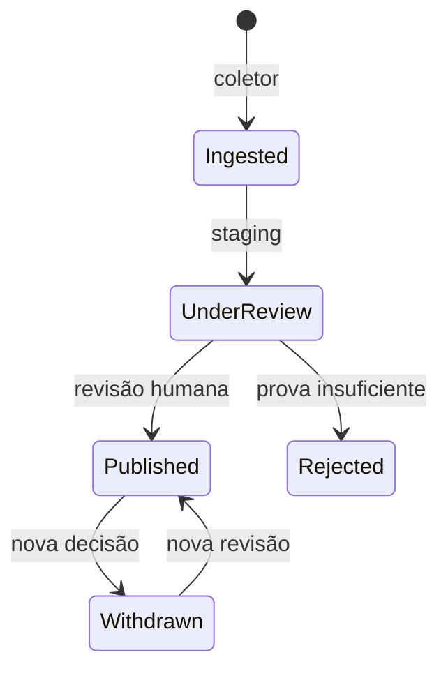

# V3 — circuito de dados reais

## Invariantes

1. Recolher não publica.
2. “Observado em” não significa “mandato iniciado em”.
3. Um voto só é nominal quando a fonte fornece identificador individual e este corresponde
   exatamente a uma pessoa recolhida.
4. Uma relação só é pública quando os dois nós e a aresta estão verificados e publicados.
5. Retirar um registo acrescenta uma decisão; não apaga a decisão anterior.
6. Se a API falhar, a PWA muda para `UNAVAILABLE`; não conserva silenciosamente a aparência de
   atualização em tempo real.

## Estados



Os nomes exatos variam por modelo, mas a fronteira é a mesma. `PERSON` e `PROMISE` são filtrados
pela última revisão; contratos, entidades e relações exigem também `VERIFIED` + `PUBLISHED`.

## Operação mínima

```bash
cd backend
python -m scripts.sync_parliament deputies --legislature XVII --persist
python -m scripts.sync_parliament votes --legislature XVII --persist
python -m scripts.sync_base_contracts --year 2026 --output ../data/base-review.json --persist
```

Inspecione o documento, o hash, as contagens e os avisos em `source_documents` e `sync_runs`. Só
depois use `scripts.review_publication` com `--confirm-source-reviewed`.

## Projeções públicas

| Projeção | Porta de publicação |
|---|---|
| Perfis | última `DataPublicationReview(PERSON)` publicável + snapshot oficial |
| Votos no perfil | pessoa por ID, `actorType=PERSON`, votação nominal, escolha conhecida |
| Promessas | estado verificável + evidência + última `PromiseReview=ACCEPT` |
| Contratos | `verificationStatus=VERIFIED` e `publicationStatus=PUBLISHED` |
| Grafo | aresta e ambos os nós verificados/publicados |
| Comparações | par comparável, verificado, publicado e voto nominal da mesma pessoa |

## Limitação deliberada

A V3 não transforma automaticamente contratos BASE em relações de interesse. A ingestão cria
contratos, organizações e nós privados. Correspondências e arestas exigem prova adicional e revisão
editorial. Esta limitação evita converter coincidências de nomes ou papéis contratuais em acusações.
