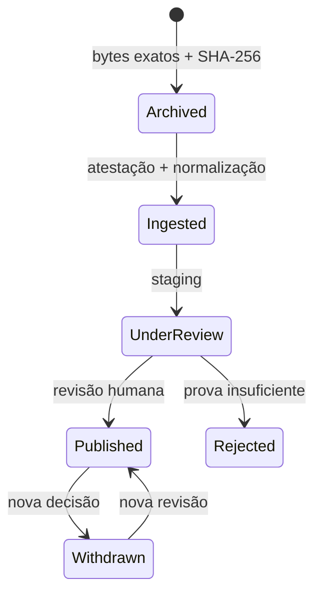

# V3 — circuito de dados reais

## Invariantes

1. Recolher não publica.
2. “Observado em” não significa “mandato iniciado em”.
3. Um voto só é nominal quando a fonte fornece identificador individual e este corresponde
   exatamente a uma pessoa recolhida.
4. Uma relação só é pública quando os dois nós e a aresta estão verificados e publicados.
5. Retirar um registo acrescenta uma decisão; não apaga a decisão anterior.
6. Se a API falhar, a PWA muda para `UNAVAILABLE`; não conserva silenciosamente a aparência de
   atualização em tempo real.
7. Na V4.1, nenhuma fonte derivada é publicável sem objeto bruto atestado com o mesmo URL e
   SHA-256; arquivo não equivale a revisão.

## Estados



Os nomes exatos variam por modelo, mas a fronteira é a mesma. `PERSON` e `PROMISE` são filtrados
pela última revisão; contratos, entidades e relações exigem também `VERIFIED` + `PUBLISHED`.

## Operação mínima

```bash
cd backend
ENVIRONMENT=staging RAW_ARCHIVE_ROOT=/caminho/privado/fora-do-repositorio \
  python -m scripts.sync_parliament deputies --legislature XVII --persist
ENVIRONMENT=staging RAW_ARCHIVE_ROOT=/caminho/privado/fora-do-repositorio \
  python -m scripts.sync_parliament votes --legislature XVII --persist
python -m scripts.sync_base_contracts \
  --year 2026 --output /caminho/privado/base-review.json
```

O exemplo BASE acima é apenas uma pré-visualização. Uma persistência autorizada exige um destino
privado fora do repositório, `ENVIRONMENT=staging`, `RAW_ARCHIVE_ROOT`, `--persist` e
`--confirm-staging`; consulte `V4_BASE_STAGING.md` antes da operação.

Nas sincronizações parlamentares, confirme primeiro o destino de `DATABASE_URL` e configure uma
raiz absoluta, privada e exterior ao repositório. Inspecione o documento, a atestação, o objeto, o
hash, as contagens e os avisos em `source_documents`, `source_archive_attestations` e `sync_runs`.
`scripts.review_publication --confirm-source-reviewed` aplica-se apenas aos tipos de entidade
explicitamente suportados; não existe nesta versão um comando para aprovar uma fotografia de
votações.

Use `python -m scripts.inspect_source_archive --source-document-id SOURCE_ID` para verificar
metadados, tamanho e SHA-256 sem ler o conteúdo para a saída e sem escrever na base de dados.

Para a fotografia de votações, use `python -m scripts.inspect_parliament_votes --legislature XVII`.
O comando é exclusivamente de leitura e nunca cria uma decisão. Até existir versionamento
append-only, a primeira fotografia usa apenas inserções e uma segunda persistência de votos é
recusada antes de alterar eventos ou posições. Tanto o perfil como o modo Investigador exigem a
última revisão positiva ligada exatamente ao documento-fonte do voto.

O comando BASE produz sempre um JSON privado de pré-visualização/revisão. Na V4.2, `--persist` só é
aceite com confirmação explícita de staging, snapshot completo e arquivo prévio. A carga cria
`BaseStagingBatch`, `BaseContractSnapshot` e `BaseContractPartySnapshot`, todos append-only, mas não
cria entidades ou contratos públicos. Use `python -m scripts.inspect_base_staging --year 2026`
para verificar a fonte, o SHA-256, as contagens e os avisos sem devolver nomes ou HMAC.

## Projeções públicas

| Projeção | Porta de publicação |
|---|---|
| Perfis | fonte arquivada + última `DataPublicationReview(PERSON)` publicável + snapshot oficial |
| Votos no perfil | fonte arquivada + pessoa por ID, `actorType=PERSON`, votação nominal, escolha conhecida + última revisão positiva da mesma fotografia |
| Promessas | fontes do programa/evidência arquivadas + estado verificável + última `PromiseReview=ACCEPT` |
| Contratos | fonte arquivada + `verificationStatus=VERIFIED` e `publicationStatus=PUBLISHED` |
| Grafo | fonte arquivada + aresta e ambos os nós verificados/publicados |
| Comparações | fontes arquivadas + par comparável, verificado, publicado e voto nominal da mesma pessoa |

## Limitação deliberada

A V4.2 não transforma automaticamente snapshots BASE em relações de interesse. A persistência cria
apenas um lote privado e o respetivo `SyncRun`; não cria `PublicContract`, organizações, nós,
candidatos ou arestas. Correspondências e relações exigem prova adicional e revisão editorial.
Esta limitação evita converter coincidências de nomes ou papéis contratuais em acusações.
