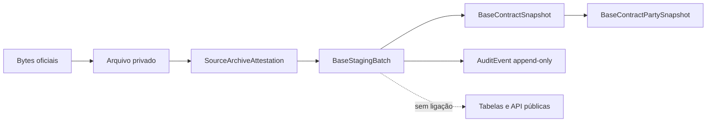

# V4.2 — staging privado e append-only do Portal BASE

## Objetivo

A V4.2 permite conservar uma fotografia normalizada dos contratos do recurso anual oficial BASE
sem a confundir com publicação. O original é arquivado e atestado primeiro; só depois o PostgreSQL
recebe um lote privado, os contratos e as partes tal como constam da fonte.

Este circuito não cria `PublicContract`, `Organisation`, `InterestEntity`, `ContractMatchReview`,
`InterestRelationship` ou `DataPublicationReview`. Não existe nesta versão uma promoção automática
do staging BASE. Uma correspondência produzida com `--actors-file` continua exclusivamente no
ficheiro privado de revisão e nunca entra na base.

## Invariantes

1. O URL efetivo, a data de recolha e o SHA-256 referem-se aos bytes exatos recebidos.
2. O arquivo content-addressed é criado e verificado antes de abrir a ligação à base de dados.
3. `SourceDocument`, atestação, lote, contratos, partes e `AuditEvent` entram na mesma transação.
4. Os três níveis de staging e `AuditEvent` rejeitam `UPDATE` e `DELETE` por trigger PostgreSQL.
5. Uma amostra recolhida com `--limit` nunca pode ser persistida como fotografia anual.
6. Uma coleção vazia significa dados indisponíveis ou parser por rever; não cria um lote vazio.
7. Nomes e objetos que contenham uma sequência fiscal potencial são recusados sem repetir o valor.
8. Um identificador fiscal nunca é guardado em claro. Só um HMAC-SHA-256 com pepper durável pode
   entrar na tabela privada de partes.
9. Sem `PROTECTED_IDENTIFIER_PEPPER`, o digest efémero usado durante a recolha é descartado e o
   inspetor assinala o cruzamento fiscal como “dados indisponíveis”.
10. Ingestão, atestação e inspeção não constituem revisão humana nem autorização de publicação.

## Modelo privado



`BaseStagingBatch` liga um `SourceDocument` atestado ao `SyncRun`, ano, versão do parser, contagens e
SHA-256 da normalização. `BaseContractSnapshot` usa unicidade por lote e identificador oficial; o
mesmo identificador pode reaparecer numa fotografia posterior sem substituir a versão anterior.
`BaseContractPartySnapshot` conserva o papel e a designação da fonte; o digest protegido é opcional
e privado.

A migração é
`prisma/migrations/20260803080000_v4_base_staging/migration.sql`. Além das chaves e `CHECK`, um
trigger valida que o lote aponta para uma fonte `BASE_GOV`, um arquivo com o mesmo URL/hash e um
`SyncRun` com a mesma versão do parser.

## Pré-visualização sem persistência

O destino tem de ser privado e ficar fora do repositório:

```bash
cd backend
python -m scripts.sync_base_contracts \
  --year 2026 \
  --output /caminho/privado/base-2026-review.json
```

O JSON contém proveniência, avisos, contratos normalizados e, se for fornecida uma entrada privada
de atores, candidatos `PENDING_REVIEW`. Não contém NIF/NIPC nem HMAC.

## Persistência autorizada em staging

Antes da operação, confirme por um meio independente que `DATABASE_URL` aponta exclusivamente para
staging. Configure uma raiz de arquivo absoluta, privada e exterior ao repositório. Não use disco
efémero, uma pasta pública ou um diretório de CI.

```bash
cd backend
ENVIRONMENT=staging \
DATABASE_URL='postgresql://…/staging' \
RAW_ARCHIVE_ROOT=/caminho/privado/raw-evidence \
PROTECTED_IDENTIFIER_PEPPER='segredo-estavel-com-pelo-menos-32-carateres' \
python -m scripts.sync_base_contracts \
  --year 2026 \
  --output /caminho/privado/base-2026-review.json \
  --persist \
  --confirm-staging
```

As duas opções são obrigatórias. `ENVIRONMENT` diferente de `staging`, arquivo ausente, coleção
vazia, `--limit`, URL/hash/data divergentes ou fonte não oficial fazem a operação falhar antes da
carga. A escrita usa `COPY` para o lote completo e não executa `INSERT` nas tabelas públicas.

No Windows PowerShell, defina as mesmas variáveis com `$env:NOME = 'valor'` e use um destino como
`D:\transparencia-total-private\base-2026-review.json`.

## Inspeção privada

Depois de uma carga autorizada, obtenha apenas metadados, contagens e distribuições:

```bash
cd backend
python -m scripts.inspect_base_staging --year 2026
```

O relatório não devolve nomes, objetos contratuais ou valores de HMAC. Inclui as verificações de
fonte, arquivo, versão do parser, contagens e distribuições. Mantém sempre
`publication_eligible=false`.

## Repetições e novas versões

- Uma repetição exata dos mesmos bytes com a mesma versão do parser é idempotente: não acrescenta
  contratos ou partes duplicados.
- Os mesmos bytes normalizados por uma nova versão do parser criam outro lote.
- Bytes diferentes criam outro `SourceDocument` e outro lote, mesmo que o URL seja igual.
- Conteúdo divergente com o mesmo identificador dentro da mesma recolha é excluído integralmente e
  enviado para revisão; o coletor não escolhe uma versão.
- Qualquer correção futura acrescenta uma versão e um evento. Os snapshots anteriores não são
  alterados nem apagados.

## Limites atuais

O backend de ficheiros da V4.1 continua reservado a desenvolvimento, testes e staging controlado.
Produção exige object storage privado com versionamento ou retenção WORM, encriptação, controlo de
acesso, backups e política de retenção. A V4.2 também não implementa o circuito humano que promove
um snapshot para `PublicContract`; essa etapa tem de comparar a prova, criar uma decisão explícita
e preservar todas as versões antes de qualquer dado chegar à API pública.

