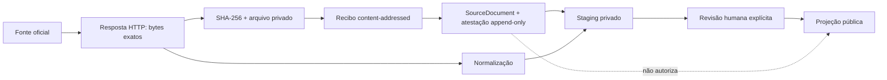

# V4.1 — arquivo privado de prova bruta

## Objetivo

A V4.1 conserva os bytes exatos recebidos de uma fonte oficial antes de persistir os dados
normalizados. O arquivo é privado, content-addressed e separado da base de dados. A base de dados
guarda apenas uma atestação append-only que liga o `SourceDocument` ao objeto através do mesmo URL
efetivo e SHA-256.

Arquivar um original não o revê e não o publica. É apenas mais uma condição necessária para uma
publicação futura. As projeções públicas recusam documentos sem uma atestação coerente. A inspeção
operacional comunica uma atestação, configuração, objeto ou permissão de leitura ausente como
`UNAVAILABLE` — dados indisponíveis — e nunca como ausência de factos na fonte.

## Invariantes

1. O hash é calculado sobre os bytes da resposta HTTP, antes de descodificação ou normalização.
2. A chave é exatamente `sha256/<dois primeiros hex>/<sha256 completo>`.
3. Um objeto existente nunca é substituído. Uma divergência de tamanho ou hash bloqueia o fluxo.
4. O conteúdo bruto não entra na serialização Pydantic, nos logs, no PostgreSQL ou na API pública.
5. `SourceArchiveAttestation` só aceita `INSERT`; PostgreSQL rejeita `UPDATE` e `DELETE`.
6. O URL e o SHA-256 da atestação têm de coincidir com o `SourceDocument` referenciado.
7. Depois de atestado, o URL e o SHA-256 que ancoram esse `SourceDocument` não podem ser alterados.
8. A atestação cria um `AuditEvent`, mas nunca uma `DataPublicationReview`.
9. Revisões humanas e regras específicas de publicação continuam obrigatórias e independentes.

## Fluxo



Na sincronização parlamentar persistente, o arquivo é configurado antes do pedido à fonte. Depois
da recolha, o objeto é criado e verificado antes de existir qualquer escrita na base de dados. O
`SourceDocument`, a atestação, o `AuditEvent` e os registos normalizados entram na mesma transação.

Os coletores do Parlamento, BASE e DRE já transportam o original num modelo privado excluído da
serialização. Nesta etapa, apenas a persistência parlamentar consome automaticamente o recibo de
arquivo. A V4.2 liga também o recibo aos snapshots BASE append-only exclusivamente em staging; DRE
continua sem persistência ou circuito de publicação.

## Backend de ficheiros local

O backend atual existe para desenvolvimento, testes e operações controladas de staging. Configure
`RAW_ARCHIVE_ROOT` com um caminho absoluto, privado e fora do repositório:

```dotenv
RAW_ARCHIVE_ROOT=/srv/transparencia-total-private/raw-evidence
```

No Windows, use por exemplo `D:\transparencia-total-private\raw-evidence`. Não use uma pasta do
repositório, um volume publicado pelo servidor web, a pasta de outputs de CI ou armazenamento
efémero de uma plataforma de deploy. O código recusa caminhos relativos, caminhos interiores ao
repositório e uma raiz que seja uma ligação simbólica.

O serviço expõe apenas duas operações: criar/verificar idempotentemente um objeto e verificar a
sua integridade. Não existe API de leitura do conteúdo, substituição ou eliminação.

## Operação parlamentar

A recolha sem `--persist` continua a produzir apenas a representação normalizada e não exige
arquivo:

```bash
cd backend
python -m scripts.sync_parliament votes --legislature XVII --output ../data/votes.json
```

Para a persistência V4, confirme primeiro o destino de `DATABASE_URL`. Os bytes são guardados no
arquivo content-addressed PostgreSQL antes da fotografia:

```bash
python -m scripts.sync_parliament_activity --legislature XVII
```

O comando arquiva e atesta; não cria revisão humana nem publica posições. Repetir a mesma fonte e
parser é idempotente; uma correção exige nova versão e preserva a fotografia anterior.

## Arquivar um `SourceDocument` histórico

Este comando destina-se apenas a staging e exige duas confirmações explícitas:

```bash
ENVIRONMENT=staging \
RAW_ARCHIVE_ROOT=/srv/transparencia-total-private/raw-evidence \
python -m scripts.archive_source_document \
  --source-document-id SOURCE_ID \
  --actor operador-auditavel \
  --persist-attestation \
  --confirm-staging
```

O URL efetivo atual e o SHA-256 dos bytes têm de coincidir exatamente com o registo histórico. Se a
fonte tiver mudado, o comando recusa atribuir os bytes novos ao documento antigo: deve ser criada
uma nova versão de `SourceDocument`.

## Inspeção privada

A inspeção lê metadados e volta a calcular tamanho e SHA-256; não devolve os bytes e não escreve na
base de dados:

```bash
python -m scripts.inspect_source_archive --source-document-id SOURCE_ID
```

Os estados possíveis são:

- `VERIFIED`: tamanho e SHA-256 correspondem à atestação;
- `UNAVAILABLE`: não há atestação, configuração, objeto ou permissão de leitura;
- `CORRUPT`: existe um objeto inadequado, simbólico ou com conteúdo divergente.

Mesmo com `VERIFIED`, o relatório mantém `publication_eligible=false` porque a inspeção de arquivo
não substitui a revisão humana.

## Limite de produção

O backend de ficheiros local mantém-se reservado a desenvolvimento, testes e staging controlado.
O circuito parlamentar da V4 conserva os bytes oficiais diretamente no PostgreSQL, por SHA-256,
antes de criar a fotografia normalizada. Esse arquivo só é adequado a produção quando a base tem
armazenamento persistente, backups testados, encriptação, controlo de acesso e política de retenção;
um plano gratuito com disco efémero não cumpre este gate. Para volumes maiores, object storage
privado com versionamento ou retenção WORM continua a ser a evolução recomendada. Nenhum destes
backends altera as regras de proveniência, revisão ou publicação.
