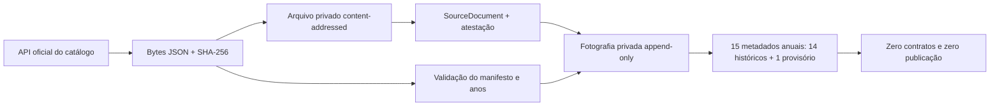

# V5.49 — âmbito temporal privado do Portal BASE

## Resultado

A V5.49 fixa, antes de qualquer recolha de contratos, qual é o universo anual oficialmente
observável no catálogo do dados.gov.pt. A fotografia continua exclusivamente privada e não cria
`PublicContract`, organizações, candidatos de correspondência, relações, revisões ou publicação.

Na verificação de 30 de agosto de 2026, o dataset oficial identificado por
`66d72d488ca4b7cb2de28712` declarava:

- produtor: IMPIC — Instituto dos Mercados Públicos, do Imobiliário e da Construção;
- licença indicada no catálogo: `other-pd` (domínio público);
- frequência indicada: semanal;
- um recurso ZIP de contratos para cada ano de 2012 a 2026, além de versões XLSX;
- atualização do catálogo em 24 de agosto de 2026.

A reprodução read-only feita durante esta entrega recolheu 45 952 bytes em
`2026-08-30T08:21:22Z`, com SHA-256 bruto
`f69f09be1679163eea49bb020884a9dab39d4aa68d280fe1445b395e123b9c21` e SHA-256 canónico do
âmbito `00069c0b7331e5bad5989f89f9d679ea68edacf2283628a3bb346321b4b8a05f`. Esta observação local
não substitui a futura atestação de staging; uma atualização semanal legítima produzirá outros
bytes e outra fotografia.

Fonte pública: [dataset oficial de contratos do Portal BASE no dados.gov.pt](https://dados.gov.pt/pt/datasets/contratos-publicos-portal-base-impic-contratos-de-2012-a-2026/).
O próprio [Portal BASE explica as formas oficiais de obter dados](https://www.base.gov.pt/Base4/pt/documentacao/formas-de-obter-dados-sobre-os-contratos-publicos/)
e que os dados públicos podem ser extraídos gratuitamente em formatos abertos.

Estas afirmações são metadados da fonte observada, não uma garantia de que todos os contratos
existentes tenham sido comunicados, de que todos os campos estejam completos ou de que o recurso
do ano corrente já contenha o ano inteiro.

## Política temporal

O manifesto versionado `data/base-contracts-scope-v1.json` estabelece uma regra simples e
reproduzível:

1. `2012` é o primeiro ano aceite;
2. todos os anos civis terminados até ao ano anterior à recolha são classificados como
   `HISTORICAL_CLOSED_YEAR`;
3. o ano civil da recolha é sempre `CURRENT_ROLLING_YEAR`;
4. tem de existir exatamente um ZIP oficial para cada ano, sem intervalos nem duplicados;
5. XLSX é ignorado nesta cadeia para evitar duas representações concorrentes do mesmo período;
6. uma falta, mudança de produtor, licença, frequência, identificador, URL estável ou estrutura
   termina a operação como `Dados indisponíveis`.

Em 30 de agosto de 2026, a política resulta em 2012–2025 como períodos históricos fechados e 2026
como período corrente provisório. “Fechado” significa apenas que o ano civil terminou; não significa
que o dump seja definitivo. Se o IMPIC corrigir um ano anterior, os novos bytes, URL de versão,
SHA-256 e metadados criam outra fotografia append-only e preservam a anterior.

## Cadeia de prova

O comando manual `stage-base-catalogue-scope`:

- só aparece no workflow segregado de staging;
- exige confirmação específica e o `environment` protegido;
- confirma o project ref e recusa refs proibidos antes da escrita;
- verifica primeiro a migração, as tabelas, RLS e triggers;
- arquiva os bytes antes de persistir a fotografia;
- guarda URL, data, tamanho, SHA-256 bruto, SHA-256 canónico e versão da política;
- conserva um recurso ZIP exato por ano, com ID oficial, URL estável, URL versionado, data e
  tamanho declarado;
- é idempotente para os mesmos bytes e a mesma versão;
- nunca executa o coletor de contratos.

As tabelas `base_contract_catalogue_scopes` e `base_contract_catalogue_resources` têm RLS sem
políticas para clientes, privilégios revogados, triggers append-only e uma validação diferida que
impede fotografias com lacunas, contagens falsas ou classificação temporal incoerente.

## Limites desta etapa

A V5.49 fecha somente o primeiro item do Investigador Cívico: definir e provar o âmbito temporal.
Continuam separados e pendentes:

- executar a migração e a operação em staging real;
- descarregar e arquivar cada ZIP anual;
- ligar cada lote de contratos ao recurso exato desta fotografia;
- medir linhas lidas, excluídas, em conflito e normalizadas por ano;
- configurar o pepper HMAC estável fora do repositório;
- revisão individual de contratos e prova própria das organizações;
- candidatos privados de correspondência e relações;
- direito de resposta, AIPD e revisão jurídica operacional;
- qualquer página ou projeção pública do Investigador Cívico.

Uma lista vazia ou um ano ausente nunca prova que não existem contratos. Significa apenas que os
dados necessários não estão disponíveis ou não passaram a cadeia de validação.
