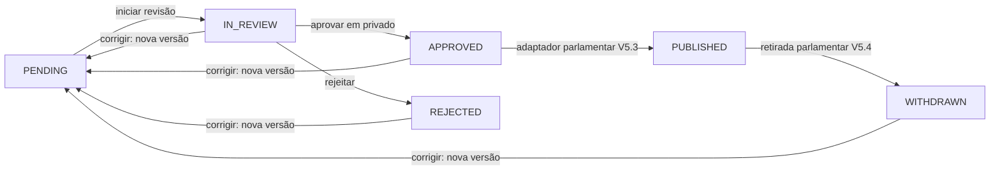

# V5.1 — painel privado e fundação editorial

## Estado

Esta entrega é a primeira fundação da V5. Não altera nem volta a publicar dados da V4 e não cria
uma ação genérica de publicação. O objetivo é permitir que administradores e revisores comparem
uma fonte arquivada com dados normalizados, tomem decisões explícitas e preservem todo o histórico.

## Garantias do circuito

- O login é por convite no Supabase Auth; não existe registo público.
- A consulta ou alteração de conteúdo editorial exige um JWT Supabase com assinatura assimétrica
  validada no backend, conta `staff_profiles` ativa e nível MFA `aal2`.
- Email, segredo TOTP e códigos MFA permanecem no Supabase Auth. A base da aplicação guarda apenas
  o UUID Auth, alias público, função e estado ativo.
- As tabelas editoriais têm RLS ativa e nenhum privilégio para `PUBLIC`, `anon` ou `authenticated`.
  O browser nunca lê estas tabelas diretamente; utiliza a API FastAPI privada.
- Um processo só pode nascer sobre um `SourceDocument` cuja URL, data e SHA-256 coincidam com uma
  `SourceArchiveAttestation`. A seleção aceita apenas publicadores oficiais explicitamente
  enumerados e exclui documentos classificados como notícias; este projeto não é um agregador de
  notícias.
- `EditorialVersion`, `EditorialDecision` e `EditorialPublicationEvent` são append-only por trigger
  PostgreSQL. Uma correção acrescenta uma versão e regressa a `PENDING`.
- A projeção mutável de `EditorialCase` só muda quando existe uma decisão imutável com a revisão,
  versão, estado anterior e estado resultante correspondentes.
- A aprovação exige confirmação humana da fonte, mas permanece privada. Esta entrega não expõe
  endpoint nem botão de publicação.
- O modelo distingue propostas de origem humana, ingestão e IA. Ingestão e IA não podem assumir
  uma identidade humana; decisões continuam reservadas a staff autenticado.
- NIF/NIPC em claro são recusados nos dados normalizados. Um identificador fiscal só pode ser
  tratado como HMAC-SHA-256 com o pepper privado do backend.

## Estados e transições disponíveis



`PUBLISHED` e `WITHDRAWN` continuam reservados a adaptadores específicos por domínio. O circuito
parlamentar implementa essas transições nas V5.3 e V5.4: apenas um administrador com MFA pode
executá-las, e cada ação acrescenta um `EditorialPublicationEvent` ligado à versão e ao destino
concretos. Não existe endpoint genérico para promover ou retirar outros tipos editoriais.

## Configuração por ambiente

Frontend:

```dotenv
NEXT_PUBLIC_SUPABASE_URL=https://PROJECT_REF.supabase.co
NEXT_PUBLIC_SUPABASE_PUBLISHABLE_KEY=sb_publishable_...
NEXT_PUBLIC_API_URL=https://api.example.org
ADMIN_API_URL=https://api.example.org
NEXT_PUBLIC_SITE_URL=https://www.example.org
```

Backend:

```dotenv
SUPABASE_URL=https://PROJECT_REF.supabase.co
SUPABASE_JWT_AUDIENCE=authenticated
SUPABASE_JWKS_CACHE_SECONDS=600
```

Não é necessária uma `service_role` nem uma secret key Supabase na aplicação. O frontend utiliza
apenas a publishable key. O backend consulta o JWKS público e aceita somente `ES256` ou `RS256` com
`kid`, emissor e audiência esperados. Antes da ativação, o projeto Supabase deve usar uma signing
key assimétrica; tokens legacy `HS256` são recusados de propósito.

No Supabase Auth devem ser configurados o URL público do site e o redirect permitido
`https://www.example.org/auth/confirmar`. O mesmo deve ser feito para cada preview autorizado; não
se deve usar um wildcard mais amplo do que o necessário.

## Convite e bootstrap de staff

1. No dashboard Supabase, convide o endereço da pessoa. Não crie um endpoint de convite no site.
2. Confirme o UUID em **Authentication → Users**.
3. No SQL Editor, numa sessão administrativa, associe esse UUID a um alias público. O alias só pode
   conter letras minúsculas ASCII, algarismos, ponto, hífen ou underscore.

```sql
BEGIN;

INSERT INTO public.staff_profiles
    (id, auth_user_id, public_alias, role, active, created_at, updated_at)
VALUES
    ('staff_SUBSTITUIR_POR_ID_ALEATORIO',
     'SUBSTITUIR_PELO_UUID_AUTH'::uuid,
     'alias-publico',
     'ADMIN'::public."StaffRole",
     TRUE,
     NOW(),
     NOW());

COMMIT;
```

Use `REVIEWER` para quem não administra o circuito. O painel desta entrega não gere utilizadores;
ativação, desativação e alteração de função continuam a ser uma operação administrativa direta e
deliberada.

## Ordem de ativação

1. Aplicar a migração primeiro numa base descartável e executar os testes PostgreSQL.
2. Aplicar em staging e criar uma conta `ADMIN` de ensaio.
3. Confirmar login por convite, configuração TOTP e recusa de sessão `aal1` nas rotas editoriais.
4. Criar um processo sobre uma fonte já atestada; comparar URL, data e hashes.
5. Testar `PENDING → IN_REVIEW → APPROVED` e confirmar que nenhuma tabela pública muda.
6. Criar uma correção e confirmar que a versão anterior e todas as decisões permanecem legíveis.
7. Só depois de revisão de segurança e CI verde configurar produção. Deploy, migração e criação de
   staff exigem autorizações operacionais separadas.

A preparação V5.8 acrescenta um PostgreSQL descartável com a forma mínima do Supabase, exerce a FK
`staff_profiles → auth.users` no CI e fornece uma inspeção estrutural exclusivamente read-only. A
ordem completa e as verificações que continuam obrigatoriamente manuais estão em
[V5.8 — prontidão editorial para staging](V5_EDITORIAL_STAGING_READINESS.md).

## Entregas parlamentares seguintes

A adaptação privada das fotografias parlamentares está descrita em
[V5.2 — adaptação parlamentar ao circuito editorial](V5_PARLIAMENT_EDITORIAL_ADAPTER.md). Ela cria
propostas por âmbito a partir de snapshots atestados e apresenta diferenças por identificador
oficial exato, sem converter posições coletivas em votos individuais. A ligação deliberadamente
separada de um âmbito aprovado à porta pública V4 está especificada em
[V5.3 — publicação parlamentar específica por âmbito](V5_PARLIAMENT_SCOPE_PUBLICATION.md).
A retirada imutável, o registo público redigido e o regresso obrigatório a uma nova revisão estão
descritos em [V5.4 — retirada parlamentar imutável](V5_PARLIAMENT_WITHDRAWAL.md).
