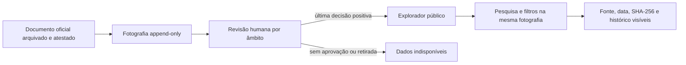

# V5.5 — experiência pública da atividade parlamentar

## Objetivo

A V5.5 transforma as listas parlamentares extensas numa consulta pública pesquisável, filtrável e
paginada, sem contornar o circuito editorial criado nas V5.1 a V5.4. A interface continua a ler
somente uma fotografia oficial arquivada, atestada e aprovada por revisão humana para cada âmbito e
legislatura.

Esta entrega é preparada e verificada localmente. **Não publica nem retira dados reais**, não aplica
migrações remotas, não configura o Supabase, não cria utilizadores, não altera segredos e não faz
deploy.

## Fluxo de leitura

Pesquisa e filtros não criam uma nova interpretação editorial. Limitam apenas os registos da
fotografia já publicada.

## Endpoint aditivo

`GET /api/v1/public/parliament/explore` acrescenta uma porta de consulta sem remover nem alterar os
três endpoints públicos V4 de reuniões, iniciativas e votações. Os clientes existentes continuam a
funcionar.

O endpoint aceita:

- âmbito: reuniões, iniciativas ou votações;
- legislatura;
- texto no título, número ou identificador oficial do próprio registo;
- intervalo de datas;
- tipo e fase oficial da iniciativa, quando aplicável;
- resultado e natureza nominal indicados na votação;
- posição registada;
- grupo parlamentar **apenas pelo `source_id` oficial exato**;
- limite e deslocamento com limites explícitos.

Os valores são parametrizados. Os carateres `%`, `_` e o marcador de escape são tratados como texto
na pesquisa. As posições de todas as votações de uma página são carregadas em lote, evitando uma
consulta por votação.

## Identidade sem aproximações

O filtro de grupo usa exclusivamente `parties.source_id`. A designação textual recebida da fonte é
apresentada ao cidadão, mas nunca é usada para associar uma sigla ou nome a uma entidade interna.
Uma posição individual só pode indicar uma pessoa associada quando existir `people.source_id`; uma
posição coletiva continua coletiva.

Para tornar essa garantia verificável também em fotografias futuras, a versão do normalizador passa
a `parliament-activity-v5`. Nessa versão, `party_id` só é preenchido quando o registo de voto traz
`actor_source_id` e este coincide exatamente com `parties.source_id`. A versão pública ignora
ligações partidárias de normalizadores anteriores, que podiam ter sido criadas a partir de uma
sigla textual exata. O histórico não é apagado nem reescrito.

Foi removido do perfil político o cruzamento anterior que normalizava uma sigla partidária para
procurar posições coletivas. Até existir um identificador oficial inequívoco de ponta a ponta, essa
área mostra “dados indisponíveis”. Isto evita transformar semelhança textual em facto.

## Explicadores responsáveis

Os explicadores desta etapa são regras determinísticas de apresentação, não conteúdo gerado por IA.
Distinguem sempre:

1. o resultado ou fase que a fonte regista;
2. entrada em vigor ou efeito jurídico;
3. execução administrativa;
4. impacto material no cidadão.

Uma votação ou fase isolada só prova o primeiro ponto. Sem diploma, decisão, orçamento ou outra
prova oficial adequada, os restantes ficam como **dados indisponíveis**. A interface não recomenda
partidos, não atribui intenções e não pinta aprovação como “boa” nem rejeição como “má”.

## Temas e cobertura

A fotografia parlamentar atual não contém um campo temático oficial estruturado. Por isso, o
explorador declara `topics_available=false` e não inventa temas por palavras-chave nem por IA. Os
filtros temáticos só poderão ser ativados quando uma fonte oficial ou uma decisão editorial humana
auditável fornecer essa classificação.

As reuniões são observações presentes no documento recolhido, não uma agenda completa da Assembleia
da República. Uma pesquisa sem resultados ou uma lacuna da fonte nunca é apresentada como
incumprimento.

## Interface pública

A página `/atividade-parlamentar` passa a oferecer:

- endereços partilháveis através dos parâmetros da pesquisa;
- um tipo de registo em foco de cada vez;
- pesquisa e filtros consistentes;
- paginação no servidor;
- títulos de votação enriquecidos apenas quando existe uma iniciativa única com o mesmo número na
  mesma fotografia;
- indicação visível de ligações por identificador oficial;
- fonte oficial, data de recolha, SHA-256 e histórico imutável;
- disposição responsiva sem depender de JavaScript no navegador.

Se a API não responder, a página falha de forma fechada e não substitui a fotografia por dados de
demonstração ou por uma versão antiga não selecionada pelo circuito editorial.

## Desempenho e evolução

A fotografia atual é limitada e versionada, pelo que a paginação por deslocamento é adequada nesta
fase e permanece limitada a 10 000 registos. A consulta reutiliza os índices de fotografia, data,
tipo e legislatura já existentes. Crescimento relevante deverá motivar medição com `EXPLAIN
ANALYZE` e, se necessário, uma migração aditiva revista separadamente; a V5.5 não altera o esquema.

A etapa local seguinte é a V5.6: completa o contrato dos perfis políticos a partir de mandatos,
cargos, círculo, presenças, iniciativas e votos nominais com identificadores oficiais inequívocos e
cobertura explicitamente declarada. O desenho e as limitações estão documentados em
[Perfis políticos completos e auditáveis V5.6](V5_POLITICIAN_PROFILES.md).

## Garantias mantidas

- fonte oficial, data de recolha e SHA-256 acompanham os factos;
- ingestão, revisão, publicação, retirada e consulta continuam separadas;
- histórico e direito de resposta permanecem append-only;
- ausência de dados é apresentada como indisponibilidade, não incumprimento;
- não existe correspondência aproximada de pessoas, partidos ou organizações;
- posições coletivas nunca são convertidas em ações individuais;
- IA não é fonte, não classifica temas e não produz conclusões nesta etapa;
- não existe publicação automática nem mutação de dados por esta interface.
