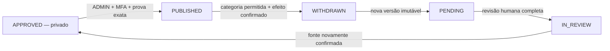

# V5.4 — retirada parlamentar imutável e ciclo de correção

## Objetivo

A V5.4 completa a primeira porta editorial parlamentar: um âmbito publicado pode ser retirado sem
apagar a fotografia, a versão normalizada, a decisão de publicação, os hashes ou a identidade
pública do decisor. Depois da retirada, uma correção acrescenta uma nova versão privada e reinicia
todo o circuito de revisão antes de uma eventual republicação.

Esta entrega prepara código, migração e testes locais. **Não executa qualquer retirada real**, não
publica dados, não aplica migrações remotas, não configura o Supabase, não cria utilizadores, não
altera segredos e não faz deploy. O teste transacional completo destina-se apenas a PostgreSQL
descartável.

## Máquina de estados

Não existe correção direta a partir de `PUBLISHED`: primeiro é necessário retirar o âmbito inteiro.
Também não existe reativação da versão retirada. Uma republicação exige uma nova versão,
`PENDING → IN_REVIEW → APPROVED` e uma nova decisão `PUBLISH`.

Os eventos de publicação passam a ser únicos por processo, **versão**, ação e alvo. Isto permite
um novo evento `PUBLISH` apenas para uma versão posterior, sem modificar ou duplicar o evento da
versão anterior.

## Fundamentos admitidos

O administrador tem de escolher uma categoria fechada, correspondente à secção de proteção contra
alteração seletiva da governação:

- erro de recolha, extração ou normalização;
- divergência reproduzível com a fonte;
- correção ou substituição pela fonte oficial;
- duplicação ou corrupção de dados;
- erro de identidade demonstrado;
- alteração metodológica documentada;
- obrigação legal ou decisão de autoridade competente;
- proteção de dados ou direitos de personalidade;
- risco de segurança;
- direitos de terceiros;
- erro no âmbito territorial, temporal ou material declarado.

Conveniência política, desconforto editorial, exposição mediática, pressão económica ou pedido de
uma pessoa interessada não são categorias válidas. Os testes verificam a enumeração fechada, mas a
avaliação factual do fundamento continua a exigir responsabilidade humana.

## Duas fundamentações, uma fronteira de divulgação

A ação recolhe dois textos diferentes:

1. **fundamentação interna completa**, guardada na decisão e no evento editorial privado;
2. **resumo público redigido**, guardado no `AuditEvent` público e apresentado no site.

O resumo público não pode conter dados pessoais, credenciais, vulnerabilidades, conteúdo privado
em revisão ou informação legalmente limitada. Quando os pormenores não possam ser divulgados, a
categoria e um resumo seguro continuam a permitir compreender a decisão sem expor o conteúdo
protegido.

## Pré-visualização e confirmações fail-closed

`GET /api/v1/editorial/parliament/cases/{case_id}/withdrawal` não escreve. Reconstrói a ligação
entre:

- processo, revisão e versão editorial atuais;
- evento `PUBLISH` da versão atual e o respetivo SHA-256 recalculado;
- `AuditEvent` público que materializou essa publicação;
- última `DataPublicationReview`, ainda positiva, do alvo e fonte exatos;
- SHA-256 da fonte, da fotografia, da versão e da prova de publicação;
- quatro contagens preservadas no evento público;
- efeito que a retirada terá na leitura pública.

O `POST` exige novamente todos esses identificadores e hashes, mais o SHA-256 do efeito público.
Uma mudança concorrente na revisão, no evento, no processo, na seleção pública ou no efeito
invalida a confirmação antes de qualquer escrita.

A retirada não depende de voltar a interpretar os bytes atuais da fonte. A sua âncora é a prova
imutável criada na publicação original. Assim, corrupção posterior do arquivo pode ser precisamente
o fundamento da retirada, sem permitir retirar um alvo que nunca tenha sido publicado pelo circuito
editorial.

## Efeito público explícito

A leitura pública V4 escolhe a fotografia cuja revisão positiva mais recente esteja ativa. Retirar
a fotografia atual pode produzir um de dois efeitos:

- `DATA_UNAVAILABLE`: não existe outra fotografia aprovada naquele âmbito e legislatura;
- `FALLBACK_TO_PREVIOUS_SNAPSHOT`: uma fotografia anterior, ainda aprovada, volta a ser a
  selecionada.

O servidor calcula o efeito sob o mesmo bloqueio transacional por legislatura usado pela porta V4,
gera o respetivo SHA-256 e obriga o administrador a confirmá-lo. Não é permitido apresentar uma
retirada como “dados indisponíveis” quando ela fará reaparecer dados anteriores.

## Commit transacional único

Depois de bloquear o processo e a legislatura, uma única transação acrescenta, por esta ordem:

1. `DataPublicationReview` negativa para o âmbito, fotografia e fonte exatos;
2. `AuditEvent` público `WITHDRAWN`, com categoria, resumo redigido, hashes, contagens e efeito;
3. `EditorialDecision` privada `WITHDRAW`, atribuída ao administrador;
4. projeção do processo de `PUBLISHED` para `WITHDRAWN`, com revisão unitária;
5. `EditorialPublicationEvent` privado `WITHDRAW`, ligado à mesma versão e alvo.

Se qualquer validação, trigger ou escrita falhar, a transação é revertida por inteiro. A restrição
diferida da base recusa um estado `WITHDRAWN` sem o respetivo evento append-only.

## Registo público preservado

`GET /api/v1/public/parliament/publication-history` apresenta os eventos parlamentares V5
publicamente divulgáveis: ação, âmbito, data, alias, resumo, categoria, fonte, hashes, contagens e
efeito. O endpoint não devolve o identificador do processo, o identificador da versão, a nota
interna nem outros dados do painel privado.

A página de atividade parlamentar mostra os eventos mais recentes e identifica claramente uma
retirada. O conteúdo retirado deixa de ser consultado pelas listas normais, mas o facto de ter sido
publicado e retirado não desaparece do histórico.

## Garantias mantidas

- origem oficial, data de recolha e SHA-256 continuam ligados ao registo;
- ingestão, revisão, publicação e retirada permanecem operações separadas;
- apenas `ADMIN` com MFA `aal2` retira ou publica;
- não existe retirada genérica para outros domínios;
- não existe correspondência aproximada de nomes;
- posições coletivas nunca são convertidas em votos individuais;
- ausência após a retirada é mostrada como dados indisponíveis, não como incumprimento;
- IA não decide, não retira e não é usada como fonte;
- versões, decisões, publicações e retiradas continuam append-only.

## Fora do âmbito

Esta etapa não cria um circuito de retirada para contratos, perfis, promessas, relações ou conteúdo
de IA. Também não implementa aconselhamento jurídico automático, eliminação material de documentos,
deploy, migração remota, configuração do Supabase, criação de staff ou alteração de dados reais.
