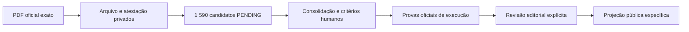

# V5.48 — catálogo integral privado do Programa do XXV Governo

## Resultado e limite desta entrega

A V5.48 substitui a antiga rotina que publicava diretamente uma amostra manual de dez registos por
um circuito de ingestão integral, determinístico e exclusivamente privado. A extração revista
identificou **1 590 itens explicitamente enumerados**, distribuídos por **40 blocos de medidas** do
Programa do XXV Governo Constitucional.

Estes números não significam «1 590 promessas», não medem cumprimento e não constituem uma
conclusão editorial. Um ponto, subponto ou alínea do documento pode ser explicativo, instrumental,
duplicado ou demasiado amplo para funcionar como compromisso verificável autónomo. Por isso, cada
item nasce como candidato `PENDING`, com o critério por definir por uma pessoa e sem projeção na
API ou no website.

## Fonte oficial fixada

| Campo | Valor revisto |
|---|---|
| Documento | Programa do XXV Governo Constitucional |
| Editor | Governo da República Portuguesa |
| URL oficial | `https://portugal.gov.pt/api/media/edge/Project/Portal-do-Governo/Portal-do-Governo/gc25/Files/Governo/programa-do-governo/ProgramaXXVGovernoConstitucional2025.pdf` |
| Data de recolha de referência | 8 de agosto de 2026 |
| SHA-256 dos bytes | `b309badfd59b990774d1552cae8f19968c3d15f202c65ac0d9c2b9c1e3ae1580` |
| Tamanho | 3 543 075 bytes |
| Extensão observada | 252 páginas |
| Manifesto | `government-programme-catalogue-v2` |
| Extrator | `government-programme-explicit-items-v2` |
| SHA-256 do catálogo normalizado | `1b30d61e22e23f712d0b2e0f33e083f8028b9b9038ededf247dabf3da6037d36` |

Uma recolha posterior pode ter outra data. Nesse caso, a data real fica na nova atestação; os bytes
só podem reutilizar este manifesto se tamanho e SHA-256 permanecerem exatamente iguais.

## Como a cobertura é demonstrada

O manifesto enumera dez blocos da parte «Agendas Transformadoras» e trinta blocos temáticos do
programa. Para cada bloco fixa antecipadamente:

- página e texto da âncora inicial;
- página e, quando existe, texto da âncora final;
- área e percurso de secção;
- contagem esperada de candidatos;
- SHA-256 da representação normalizada do bloco.

O extrator lê a disposição do PDF, conserva números, alíneas e marcadores subordinados, guarda a
página inicial e final de cada item e recusa o documento inteiro quando falta uma âncora, muda uma
contagem ou diverge um hash. O manifesto soma exatamente 1 590 candidatos; duas execuções locais
sobre os mesmos bytes produziram a mesma contagem e o mesmo digest final.

A normalização textual corrige apenas três fragmentações fechadas e observadas no content stream
do PDF. Não usa aproximação, modelo de linguagem, pesquisa por nome nem inferência semântica.

## Separação obrigatória das fases

A V5.48 implementa apenas as três primeiras caixas. Não cria `Promise`, `PromiseReview`, estado de
cumprimento, explicação de IA ou publicação. A antiga operação de produção foi desativada e o
workflow de produção deixou de oferecer essa opção.

## Persistência privada e imutável

O esquema acrescenta três conjuntos sem políticas públicas de leitura:

- `government_programme_snapshots`: identidade da fotografia, fonte, versões, hashes e contagens;
- `government_promise_catalogue_coverage`: o livro de cobertura dos 40 blocos;
- `government_promise_candidates`: texto, hierarquia, página e hashes dos 1 590 candidatos.

As tabelas têm RLS ativo e privilégios revogados a `PUBLIC`, `anon` e `authenticated`. Restrições
impedem estados diferentes de `PRIVATE_PENDING_REVIEW`, `PENDING` e
`PRIVATE_NOT_PUBLISHED`. Triggers rejeitam `UPDATE` e `DELETE`; uma nova versão do programa ou da
metodologia tem de acrescentar outra fotografia.

Um trigger diferido só permite concluir a transação quando o número total de candidatos, o número
de blocos e a contagem por bloco coincidem. Uma repetição com o mesmo PDF e metodologia compara
todas as linhas e não cria uma segunda fotografia nem um segundo evento de ingestão.

## Operação de staging

O workflow manual de staging aceita a operação `stage-government-programme-catalogue` apenas em
`main`, no repositório oficial, no environment `staging` e com a confirmação literal
`STAGING-STAGE-GOVERNMENT-PROGRAMME`.

Antes de arquivar os bytes, o comando confirma em transação read-only:

- a migração exata `20260829183000_v5_government_programme_catalogue_staging`;
- a presença das três tabelas;
- RLS ativo nas três tabelas;
- os cinco triggers de validação e imutabilidade.

Qualquer ausência termina a operação. O comando também recusa produção, destino Supabase
ambíguo, fonte não oficial, redirecionamento, MIME diferente de PDF, tamanho, páginas ou hashes
divergentes. Esta entrega não executa a migração nem a ingestão remota.

## Trabalho editorial ainda necessário

Antes de substituir o catálogo público inicial, falta:

1. executar a migração e o arquivo apenas em staging autorizado;
2. confirmar o relatório sanitizado de 40 blocos e 1 590 candidatos;
3. consolidar duplicados e excluir itens que não sejam compromissos individualizáveis, mantendo a
   decisão e o candidato original no histórico;
4. publicar o critério editorial de identificação e o critério verificável de cada compromisso;
5. associar separadamente diplomas, orçamento, regulamentação, execução e resultados materiais;
6. rever cada proposta e cada mudança de estado por ação humana autenticada;
7. ensaiar publicação e retirada em staging antes de qualquer projeção pública.

Quando uma prova oficial não existir, o estado correto é «dados indisponíveis» ou «por verificar»;
uma ausência nunca é convertida em incumprimento. A IA poderá ajudar a preparar explicações
privadas numa etapa posterior, mas não é fonte, não decide estados e tem de se abster quando os
documentos não forem suficientes.
