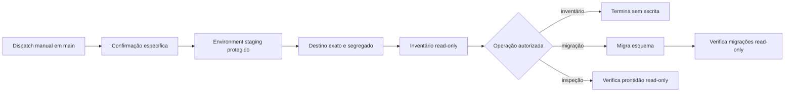

# V5.12 — fundação do workflow editorial de staging

## Estado e limite

A fundação foi revista e integrada em `main` em 13 de agosto de 2026 pela
[pull request #50](https://github.com/DxMaxi/transparencia-total-open-source/pull/50), com CI e
deployment automático do frontend aprovados. Este fecho cobre apenas código, validadores, testes e
documentação.

O workflow não foi executado, o environment GitHub `staging` não foi criado nem alterado, o
Supabase não foi configurado ou consultado, não foram adicionadas credenciais e não houve qualquer
migração, utilizador, recolha, revisão, publicação, retirada ou operação sobre dados reais.

Um commit, uma pull request, a integração em `main` ou um deployment automático do frontend não
autorizam uma execução. Cada operação remota continua a exigir uma autorização própria para o
destino exato, conforme a matriz da
[V5.11 — plano de execução editorial em staging](V5_EDITORIAL_STAGING_EXECUTION_PLAN.md).

## O que esta fundação acrescenta

- `.github/workflows/staging-editorial-operations.yml`, exclusivamente manual por
  `workflow_dispatch` e apenas a partir de `main` no repositório oficial;
- `scripts/validate-staging-workflow-inputs.mjs`, que valida a operação, a confirmação, o project
  ref, a origem CORS e a segregação do destino antes de qualquer acesso;
- `backend/scripts/inspect_staging_target.py`, que abre uma transação PostgreSQL
  `READ ONLY / REPEATABLE READ` depois de validar o destino;
- `backend/app/services/staging_target.py`, que produz um inventário de catálogo sanitizado;
- testes de contrato JavaScript e testes unitários Python para os caminhos aceites e recusados.

Não são incluídos comandos de recolha, criação de contas, alteração do Auth, escrita editorial,
publicação, retirada, geração por IA, deployment Vercel ou operação de produção.

## Operações fechadas

| Operação | Confirmação literal | Efeito máximo |
|---|---|---|
| `inventory-read-only` | `STAGING-INVENTORY-READ-ONLY` | lê apenas catálogo PostgreSQL |
| `migrate-schema` | `STAGING-MIGRATE-SCHEMA` | aplica apenas migrações Prisma |
| `inspect-readiness-read-only` | `STAGING-INSPECT-READ-ONLY` | lê catálogo e verifica guardas editoriais |

Uma confirmação não serve para outra operação. O workflow para no primeiro erro e não inclui uma
operação genérica que permita executar comandos arbitrários.

Mesmo depois de integrado, o workflow não deve ser iniciado enquanto não existir autorização
separada para a operação escolhida. A autorização do inventário read-only não autoriza a migração;
a migração não autoriza o inspetor; o inspetor não autoriza a criação de utilizadores nem qualquer
fase seguinte.

## Environment GitHub esperado

O código espera apenas os seguintes nomes. Esta documentação não contém nem cria os respetivos
valores.

| Tipo | Nome | Finalidade |
|---|---|---|
| secret | `STAGING_DATABASE_URL` | ligação PostgreSQL privada do projeto confirmado |
| variável | `STAGING_SUPABASE_URL` | origem pública HTTPS exata do projeto |
| variável | `STAGING_SUPABASE_PROJECT_REF` | identificador público exato do projeto de staging |
| variável | `STAGING_FORBIDDEN_PROJECT_REFS` | um ou mais destinos proibidos, incluindo produção |
| variável | `STAGING_CORS_ORIGIN` | origem HTTPS exata do frontend de staging |

O workflow não lê nomes `PRODUCTION_*`, `service_role`, secret keys Supabase, chaves administrativas,
pepper de identificadores ou credenciais do browser. Se uma fase futura precisar de outra
credencial, essa necessidade exige desenho, teste e autorização próprios; não deve ser antecipada
neste environment.

Quando a configuração do environment for separadamente autorizada, as regras de deployment do
GitHub devem limitá-lo à branch `main` e exigir a proteção/revisão humana apropriada. Esta restrição
da plataforma complementa — não substitui — as guardas literais dos dois jobs e do validador.

## Validação do destino antes da ligação

O pedido é recusado antes de usar o environment quando o evento não é `workflow_dispatch`, a ref
não é `refs/heads/main`, o repositório não é o oficial, a operação é desconhecida, a confirmação
não é literal ou o project ref não tem a forma esperada.

Depois de o environment ser autorizado, o validador recusa a operação quando:

- o project ref introduzido não coincide exatamente com a variável de staging;
- o project ref pertence à lista explícita de destinos proibidos;
- `SUPABASE_URL` não é a origem HTTPS exata `<project-ref>.supabase.co`;
- a origem CORS não é HTTPS, difere da variável dedicada ou coincide com o domínio público de
  produção;
- a ligação PostgreSQL não pertence ao mesmo projeto;
- falta TLS por `sslmode=require`, `verify-ca` ou `verify-full`;
- é usada uma porta, host, utilizador de pooler ou forma de ligação ambígua.

São aceites apenas a ligação administrativa à base `postgres`: ligação direta Supabase com o
utilizador `postgres` em PostgreSQL 5432, ou o session pooler em 5432 com o utilizador qualificado
pelo project ref. O transaction pooler em 6543 é recusado para estas operações de esquema e
inspeção.

## Inventário sanitizado

Antes de qualquer migração, o workflow abre uma transação read-only e verifica apenas:

- versão principal PostgreSQL 17 e estado read-only da transação;
- existência dos papéis `anon` e `authenticated` e de `auth.users`;
- contagens agregadas de tabelas e funções no schema `public`;
- nomes e contagem das migrações Prisma aplicadas.

O relatório não inclui a ligação privada, password, tokens, emails, UUID Auth, conteúdo editorial,
notas de revisão ou linhas das tabelas. Para a operação de migração, o mesmo inventário é repetido
depois da escrita e passa a exigir todas as migrações V5. Para a inspeção de prontidão, as migrações
V5 são verificadas antes de executar o inspetor editorial read-only já existente.

A V5.48 acrescenta a operação manual `stage-government-programme-catalogue`. Depois do inventário
geral, o próprio comando volta a inspecionar em modo read-only a migração exata do catálogo, as
três tabelas privadas, RLS e os triggers append-only. Só depois pode arquivar o PDF oficial e
persistir candidatos `PENDING`; não existe operação equivalente no workflow de produção.

## Ordem e falha segura

Qualquer discrepância termina a execução. Uma falha não pode ser transformada em aviso, e a
ausência de um requisito não é preenchida por inferência nem por dados de produção.

## Referências técnicas revistas

O desenho mantém separadas as permissões PostgreSQL, os privilégios da Data API e as políticas
RLS, conforme a [documentação de segurança da Data API do
Supabase](https://supabase.com/docs/guides/api/securing-your-api). As signing keys, Auth, MFA e
redirects continuam fora desta entrega; a sua futura configuração deve voltar a confirmar a
[documentação de signing keys](https://supabase.com/docs/guides/auth/signing-keys) e as
[alterações incompatíveis anunciadas pelo Supabase](https://supabase.com/changelog?types=breaking-change)
na data da execução.

## Critérios de saída da V5.12 — concluídos no código

A fundação foi considerada integrada depois de:

- os testes Python, JavaScript, lint, tipagem, validação Prisma e build terem sido aprovados;
- a revisão confirmar que não existe acionamento automático nem referência a produção;
- o patch e os limites acima terem sido aprovados numa pull request própria;
- a checklist continuar a mostrar como pendentes todas as ações remotas não executadas.

Mesmo depois da integração, a primeira ação possível é apenas pedir autorização para um inventário
remoto read-only do destino exato. Configurar o environment, adicionar o secret, executar o
inventário, migrar ou inspecionar são decisões distintas e permanecem fora desta entrega de código.
